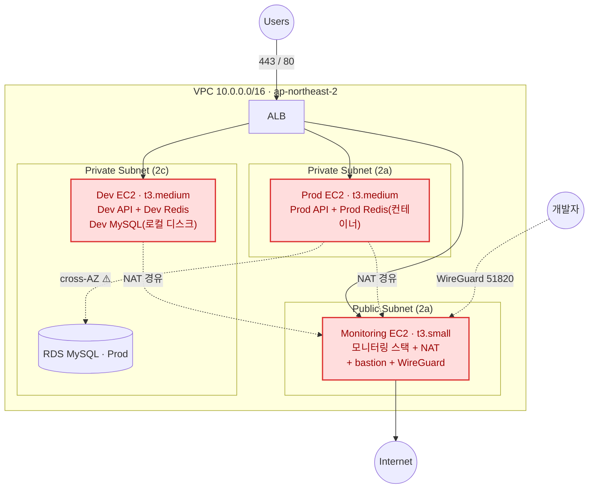
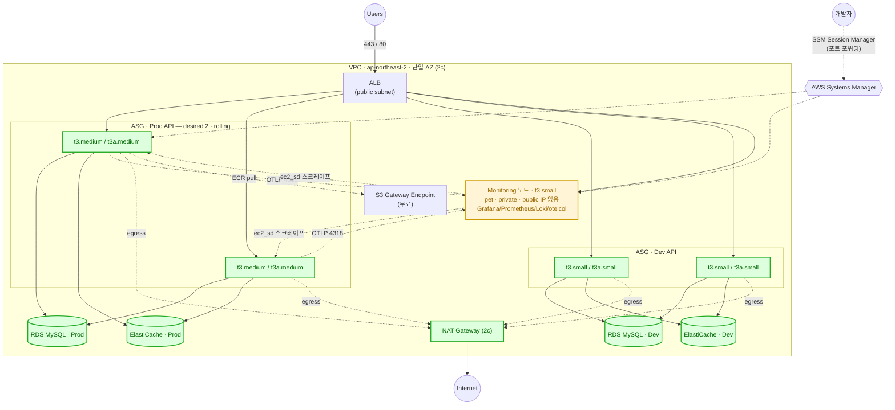

# EC2 다중화 · 무중단 하드웨어 교체 인프라 개선 설계

> 목표: Prod/Dev를 **단일 EC2(pet) 구조**에서 **ASG 기반 다중 인스턴스(cattle) 구조**로 전환하여,
> **하드웨어 보안 패치/인스턴스 교체를 다운타임 없이** 수행한다.
> 부수적으로 stateful 싱글턴을 외부화하고, 모니터링/NAT의 SPOF를 제거하며, 배포를 단순화한다.

작성 맥락: 2026-08. 신규 협업자가 "무엇을·왜" 바꾸는지 파악할 수 있도록 결정과 근거를 함께 남긴다.

## 함께 보는 문서

| 문서 | 내용 |
|---|---|
| **본 문서** | 무엇을 왜 바꾸는가 (설계와 결정 근거) |
| [`infra-ha-migration-runbook.md`](./infra-ha-migration-runbook.md) | 어떤 순서로 안전하게 이관하는가 (단계별 절차·검증·롤백) |
| [`infra-future-improvements.md`](./infra-future-improvements.md) | 이번 범위 밖이지만 이후에 다뤄야 할 항목 |

## 개정 이력

| 개정 | 변경 |
|---|---|
| v1 (초안) | ASG 전환, NAT GW, ElastiCache, Mac Mini 외부화, rolling 전환 |
| **v2 (현재)** | 12개 기술 결정 확정. 주요 변경: 노드당 태스크 상한의 근거를 메모리→**ENI**로 정정 · **Capacity Provider managed draining 추가**(v1 누락, 목표 달성의 핵심 메커니즘) · **AZ를 2c로 정렬**(RDS와 어긋나 있었음) · **Mac Mini 계획 폐기**(Dev를 AWS 관리형으로) · Redis 근거 정정(캐시 아님, 결제 상태) · **SSM Session Manager 도입**(bastion·WireGuard 폐기) · 서비스 디스커버리·state backend·Grafana as-code 추가 |

---

## 0. 이 개선의 주된 목적 (Scope)

**주 목표**: 서버 한 대가 죽는 것을 정상으로 가정하고, 여러 대를 두어 **순차적으로 하드웨어를 교체해도 무중단**인 구조.

**부수 목표**: **노드 설정의 코드-실물 일치(configuration drift 제거).**
현재는 `lifecycle { ignore_changes = [user_data] }`로 부팅 스크립트 변경이 실물에 반영되지 않아, "코드에는 있는데 서버에는 없는" 설정이 존재할 수 있다. Launch Template + instance refresh로 전환하면 노드 설정 변경이 정상적으로 롤아웃된다. 과거 Loki S3 적재 실패(credential 프록시 iptables 누락)가 이 문제의 사례다.

### 명시적 비목표 (이번 범위 밖)

| 비목표 | 이유 |
|---|---|
| **멀티 AZ / AZ 장애 생존** | 비용 대비 목적 불일치. 단일 AZ로 간다. |
| **동적 오토스케일링** | 처음엔 고정 크기 ASG. 트래픽 변동이 실측으로 확인되면 이후 도입. |
| **모니터링 노드의 무중단 교체** | 관측 평면 단절은 서비스 가용성에 영향이 없다. 모니터링 노드는 pet으로 남기고, 교체는 계획된 유지보수로 처리한다. |
| **관측 평면의 HA** | 위와 같은 이유. 대신 관측이 죽어도 페이징은 살아있도록 CloudWatch 알람 백스톱을 둔다(§2.4). |

> 핵심 구분: **"무중단 하드웨어 교체"와 "AZ 장애 생존"은 다른 목표다.**
> 전자는 여러 인스턴스만으로 달성되며 단일 AZ로 충분하다. 후자(멀티 AZ)는 이번에 하지 않는다.

---

## 1. 현재 상태 (As-Is)

| 구성 | 현재 |
|---|---|
| Prod | 1× t3.medium (Private **2a**), 정적 IP, `aws_instance` 개별 관리, **API 태스크 1개** |
| Dev | 1× t3.medium (Private 2c), 정적 IP |
| Monitoring | 1× t3.small (Public 2a) — 모니터링 스택 + **NAT 인스턴스 + bastion + WireGuard VPN 겸직** |
| Prod RDS | MySQL 8.0 단일 AZ, **실제 배치는 2c** |
| Prod Redis | ECS host-mode 단일 컨테이너 (인메모리) |
| Dev MySQL | ECS host-mode 컨테이너, **데이터가 인스턴스 로컬 디스크** `/opt/mysql-dev-data` |
| Dev Redis | ECS host-mode 단일 컨테이너 |
| 아웃바운드 | Monitoring EC2가 NAT 역할(`source_dest_check=false` + iptables MASQUERADE) |
| 개발자 접근 | WireGuard(UDP 51820, `0.0.0.0/0` 개방) → VPN 서브넷 `10.6.0.0/24` → SSH(22) |
| 배포 | CodeDeploy **Blue/Green** (`ECSAllAtOnce`, `WITH_TRAFFIC_CONTROL`) + 자동 롤백 |
| Terraform state | **로컬 파일** (S3 backend 주석 처리) |

### 현재 구조의 취약점

**v1에서 식별한 것**

1. Prod/Dev 각 1대 → 인스턴스를 건드리는 순간(패치/교체) **무조건 다운타임**.
2. Monitoring EC2가 **NAT·bastion·VPN까지 겸직** → 죽으면 Prod/Dev의 아웃바운드(ECR pull, SSM 등)와 개발자 접근이 통째로 끊기는 SPOF.
3. Dev MySQL 데이터가 **노드 로컬 디스크** → 노드를 늘리거나 재배치되면 DB 유실.

**v2에서 추가로 식별한 것**

4. **Prod EC2(2a)와 RDS(2c)의 AZ가 어긋나 있다.** 현재도 모든 DB 쿼리가 cross-AZ로 나간다. 비용과 지연 양쪽에서 손해다.
5. **Terraform state가 로컬 단일 사본이다.** 잠금·이력·백업이 없고, 신규 협업자가 state를 받을 방법이 없다. `environments/shared/`에 타임스탬프 백업이 2개 남아 있어 과거 수동 복구 흔적으로 보인다.
6. **엔드포인트가 인스턴스 사설 IP에 하드코딩되어 있다.** OTLP 엔드포인트, Redis 호스트, Prometheus 스크레이프 타깃이 모두 고정 IP에 묶여 있어 ASG 전환 시 전부 깨진다.
7. **노드 부트스트랩이 반복 실행에 견디지 못한다.** ECS 에이전트 태그 미고정(`:latest`), credential 프록시 iptables/sysctl이 재부팅에 미영속, 에이전트 사망 시 좀비 노드(`--restart=on-failure:10`), `ECS_RESERVED_MEMORY=64`(실제 오버헤드의 1/8).
8. **비밀값이 태스크 정의 환경변수에 평문으로 들어 있다.** Terraform state·태스크 정의 JSON·ECS 콘솔에 그대로 남는다.
9. **Grafana 대시보드·알림 규칙이 코드에 없다.** 노드 로컬 SQLite(`/opt/grafana/data`)에만 존재해 노드 교체 시 전부 사라진다.
10. **`memoryReservation`이 실제 사용량보다 크게 낮다**(500 vs 실측 ~1200MB). ECS 스케줄러가 노드당 태스크를 과다 배치할 수 있다.

---

## 2. 목표 상태 (To-Be)

### 2.1 컴퓨트 / ASG

| 구성 | To-Be |
|---|---|
| 관리 방식 | **고정 크기 ASG** + 자가복구 + **instance refresh**(롤링 교체), 정적 IP 폐기 |
| AMI | **ECS-optimized AMI (Amazon Linux 2023)**, AMI ID는 SSM Parameter(`/aws/service/ecs/optimized-ami/.../recommended`)로 참조 |
| Prod API | **2× t3.medium** (mixed instances: `t3.medium` / `t3a.medium`) |
| Prod Monitoring | **1× t3.small pet 노드** (ASG 아님, Private 배치) |
| Dev API | **2× t3.small** (mixed instances) |
| Monitoring/NAT 겸용 EC2 | **제거** |

#### 태스크 밀도의 상한은 메모리가 아니라 ENI다

v1은 노드당 2태스크의 근거를 메모리로 설명했으나, 실제 상한은 **ENI**다. `network_mode = "awsvpc"`는 태스크당 ENI 1개를 소비하고, t3 계열은 인스턴스 크기와 무관하게 ENI가 3개다.

| 타입 | 최대 ENI | 인스턴스 primary | **태스크용 가용 ENI** |
|---|---|---|---|
| t3.small / t3.medium / t3.large | 3 | 1 | **2** |

따라서 **노드당 API 태스크는 최대 2개**이며, 메모리를 줄이거나 타입을 키워도 늘지 않는다.

**Prod 슬롯 계산 (2노드 × 2슬롯 = 4)**

| 상황 | 슬롯 사용 | 여유 |
|---|---|---|
| 평상시 (desired 2) | 2 / 4 | 2 |
| 배포 중 (max 150% = 3태스크) | 3 / 4 | 1 |
| **노드 1대 상실** | 2 / 2 | **0** |
| 노드 1대 상실 + 배포 시도 | 3 필요 / 2 가능 | **배포 불가** ⚠️ |

> **알려진 제약(수용)**: 노드 1대를 잃은 상태에서는 배포할 수 없다. ASG가 새 노드를 띄울 때까지(약 1~2분) 대기한다. ECS-optimized AMI 채택으로 이 창을 v1 대비 1/3로 줄였다. 필요해지면 `desired`를 3으로 올려 N+1을 확보한다 — ASG이므로 값 하나만 바꾸면 된다.

**메모리 설정**

| 항목 | 현재 | To-Be | 이유 |
|---|---|---|---|
| `api_memory_reservation` | 500 | **1000** | ECS는 hard limit이 아니라 reservation으로 배치를 결정한다. 500이면 노드당 6태스크까지 배치 가능하다고 오판한다 |
| `api_memory_limit` | 1500 | 1500 (유지) | 2태스크 × 1500 = 3000MB로 t3.medium 가용치(~3.3GiB) 안 |
| `ECS_RESERVED_MEMORY` | 64 | **512** | OS + 에이전트 + node-exporter + cAdvisor의 실제 오버헤드 반영 |

#### Dev 용량 — Prod와 다른 롤링 전략을 쓴다

t3.small(2GiB)은 API 태스크를 **노드당 1개**만 담을 수 있다. 따라서 Prod와 같은 surge 방식(`100 / 150`)을 쓸 수 없고, 축소 우선 방식을 쓴다.

**t3.small 메모리 예산**

| 항목 | 값 |
|---|---|
| 물리 2048 MiB → 리눅스 가용 | 약 1900 MiB |
| OS + ECS 에이전트 + containerd (`ECS_RESERVED_MEMORY`) | 512 |
| node-exporter (DAEMON, task memory) | 128 |
| cAdvisor (DAEMON, task memory) | 256 |
| **API 태스크 가용** | **약 1000 MiB** |

| 항목 | Dev 설정 | 비고 |
|---|---|---|
| `dev_api_memory_reservation` | **800** | 현재 500 |
| `dev_api_memory_limit` | **900** | 현재 1500 — 1200으로 두면 실피크에서 물리 메모리를 넘어 OOM 위험 |
| `desired_count` | 2 | |
| `minimumHealthyPercent` / `maximumPercent` | **50% / 100%** | 노드당 1태스크 유지 |

배포 시퀀스: `구2:신0 → 1:0 → 1:1 → 0:1 → 0:2`
(구버전을 먼저 내리고 신버전을 띄우므로 배포 중 용량이 절반으로 떨어진다 — Dev이므로 수용)

**Dev promote 게이트에서 검증되는 것과 안 되는 것** (§3-5 연계)

| 검증됨 | 검증 안 됨 |
|---|---|
| 버전 공존 (1:1 구간 존재) | **surge 배치** — Prod에서 3번째 태스크가 슬롯에 들어가는 동작 |
| graceful drain · deregistration 정렬 | 피크 시점의 노드 메모리·ENI 압력 |
| readiness 헬스체크 | |
| 서킷 브레이커 롤백 | |

배포 안전성의 핵심은 그대로 검증된다. surge 배치는 Prod 전환 시 instance refresh 리허설에서 실측한다(런북 Phase 7). Dev를 t3.medium으로 올리면 Prod와 동일 전략을 쓸 수 있으나 월 $38가 추가되며, 그 예산은 Prod의 N+1 노드나 ElastiCache replica에 쓰는 편이 낫다고 판단했다.

> `dev_api_memory_limit = 900`은 **Prod 실측(1200)에서 유추한 값이며 Dev 프로파일의 실사용량은 아직 측정되지 않았다.** 전환 후 실측하여 조정한다. 여유가 부족하면 cAdvisor task memory를 256 → 160으로 조여 100 MiB를 확보할 수 있다.

#### 하드웨어 교체를 실제로 무중단으로 만드는 것 — Capacity Provider

**ASG instance refresh만으로는 ECS 태스크가 드레인되지 않는다.** 순수 instance refresh는 EC2를 종료시키고, 그 위 태스크는 in-flight 요청과 함께 죽는다. v1에는 이 사실이 빠져 있었다.

필요한 구성:

- **ECS Capacity Provider + Managed Instance Draining (`managed_draining = "ENABLED"`)**
  ASG 종료 라이프사이클 훅이 컨테이너 인스턴스를 DRAINING으로 전환하고, 태스크가 다른 노드로 옮겨간 뒤에 인스턴스를 종료한다.
- **instance refresh는 launch-before-terminate** (`MaxHealthyPercentage = 200`)
  새 노드를 먼저 띄운 뒤 옛 노드를 뺀다. §2.1의 "임시 scale-out(+1) → drain → 종료 → 축소" 패턴이 자동화된다.

현재 코드에는 capacity provider가 전혀 없다(`capacity_provider_strategy: []`). 신규 도입 항목이다.

#### 용량 확보 실패에 대한 대비

고정 크기 ASG가 단일 AZ·단일 타입에 묶이면, 그 조합의 여유 용량이 없을 때(`InsufficientInstanceCapacity`) **ASG가 인스턴스를 아예 띄우지 못한다.** AZ 전체 장애보다 자주 발생하고, 하필 노드를 교체하려는 순간에 나타난다.

→ **mixed instances policy**로 `t3.medium` + `t3a.medium`을 등록한다. t3a도 4GiB / ENI 3개로 용량 계산이 동일하고, 단가는 약 10% 저렴하다. cross-AZ 비용이나 지연을 만들지 않으면서 이 리스크만 정확히 겨냥한다.

---

### 2.2 네트워크

- **단일 AZ 유지.**
- **모든 구성요소를 `ap-northeast-2c`로 정렬한다.** RDS가 실제로 2c에 있는데 Prod EC2는 2a에 있어, 현재도 모든 DB 쿼리가 cross-AZ로 나가고 있다. ASG를 새로 만드는 김에 2c로 맞추면 **현행 대비 비용과 지연이 오히려 줄어든다.**
  - Prod API ASG, Dev API ASG, 모니터링 노드, NAT GW, ElastiCache(Prod/Dev), RDS(Prod/Dev) 전부 2c
  - ASG 서브넷을 Terraform에 **명시적으로 고정**한다(현재는 인덱스 참조라 우연에 의존).
- NAT 인스턴스 → **NAT Gateway 1개** (2c). AZ 내부에서 관리형 HA → 기존 NAT 인스턴스 SPOF 소멸.
- **S3 Gateway Endpoint 추가 (무료).** ECR 이미지 레이어는 S3에서 오므로 NAT 데이터 요금의 상당 부분이 제거된다. Interface Endpoint(ecr.api/ecr.dkr/ssm/logs)는 시간당 과금이 있으므로 실제 NAT 트래픽을 보고 이후 판단한다.
- **모든 노드에서 public IP를 제거한다.** ALB만 public subnet에 남는다.

> RDS는 `multi_az = false`이고 db_subnet_group이 2a/2c를 모두 포함해 **AZ가 코드에 고정되어 있지 않다.** 향후 재생성 시 AZ가 바뀔 수 있다는 점을 인지해야 한다.

---

### 2.3 상태 저장소 외부화 (stateful 싱글턴 제거)

| 대상 | To-Be | 비고 |
|---|---|---|
| Prod Redis | **ElastiCache 단일 노드** (`cache.t4g.micro`) | ⚠️ 한시적 조치 — 아래 참조 |
| Dev MySQL | **RDS `db.t4g.micro`** (단일 AZ) | 로컬 디스크 컨테이너 폐기 |
| Dev Redis | **별도 ElastiCache `cache.t4g.micro`** | Prod 노드와 공유하지 않음 |

**Redis 외부화는 선택이 아니다.** host-mode 싱글턴 컨테이너는 cattle 노드에서 주소도 데이터도 유지할 수 없다.

#### ⚠️ Prod Redis 단일 노드는 "캐시라서 안전한" 것이 아니다

v1은 근거를 *"캐시 유실이 애플리케이션에 critical하지 않음"* 이라고 적었으나, **사실과 다르다.** 애플리케이션 코드를 확인한 결과 Redis 내용물의 대부분은 캐시가 아니라 **결제 경로의 트랜잭션 상태**다.

| 키 | 용도 | 유실 시 |
|---|---|---|
| `checkout:idempotency:*` (TTL 30분) | **결제 멱등성 키** | **중복 결제 방어 소실** |
| `stock:reserved:*` (TTL 30분) | 옵션별 재고 예약 카운터. 초과 시 즉시 실패시키는 권위 소스 | 진행 중 예약 소실 → 재고 초과 판매 위험 |
| `checkout:session:*` (TTL 30분) | 체크아웃 세션 데이터 | 결제 진행 중 사용자 실패 |
| `active:sessions:*` | 활성 세션 추적 | 세션 추적 소실 |
| `email:verification:*`, `password_reset:rate:*` | 인증코드 · 레이트리밋 | 인증 재시도, 레이트리밋 우회 |
| `user:cache:*` (TTL 30분) | JWT 사용자 캐시 | **유일한 진짜 캐시** — DB 재조회로 회복 |

**따라서 단일 노드 선택의 정확한 의미는 이것이다: 노드 유지보수·장애 시 결제 경로 상태를 잃을 수 있는 창을 한시적으로 감수한다.**

단일 노드를 유지하는 동안의 필수 조건:

1. **유지보수 창을 트래픽 최저 시간대로 명시 지정**한다 (ElastiCache 기본값은 무작위 배정).
2. **자동 스냅샷을 활성화**한다.
3. **replica 도입을 최우선 개선 과제로 등재**한다 → [`infra-future-improvements.md`](./infra-future-improvements.md) **Urgent #1**.

---

### 2.4 관측 (Observability)

**Prod/Dev 모니터링은 통합 스택 하나로 유지한다.** (v1의 분리 계획은 철회)

v1은 "모니터링 스택 업그레이드를 Dev에서 먼저 검증"을 근거로 분리를 제안했으나:

- 스택을 두 벌 유지하면 대시보드·알람·설정이 이중화되어 **온보딩 부담(§4-6)이 오히려 늘어난다.**
- 환경 구분은 **이미 라벨로 되어 있다** (`environment=production` / `environment=development`).
- 업그레이드 검증의 상당 부분은 **config baking CI에 게이트를 추가**해 빌드 타임에 잡는 편이 빠르고 확실하다: `promtool check config`, Loki 설정 검증, 컨테이너 기동 스모크 테스트.
- 런타임 검증이 필요한 메이저 업그레이드는 **상시 병렬 스택 대신 일회성 임시 노드**로 처리한다.

#### 서비스 디스커버리

ASG 전환으로 노드 IP가 변하므로, 관측 경로의 주소 의존성을 정리해야 한다.

| 경로 | 방향 | To-Be |
|---|---|---|
| 앱 → otelcol (OTLP 4317/4318) | push | 모니터링 노드를 **pet으로 유지**하므로 고정 사설 IP 그대로 사용 |
| otelcol ↔ Prometheus ↔ Loki ↔ Grafana | 동일 노드 | host mode → `localhost` (변경 없음) |
| Prometheus → node-exporter(9100) / cAdvisor(8081) | **pull** | **`ec2_sd_config`로 전환** ⚠️ |

**`ec2_sd_config` 전환은 ASG 도입보다 반드시 먼저 이루어져야 한다.** 순서가 뒤바뀌면 새로 뜬 노드가 스크레이프 목록에 없어 **아무 신호 없이 관측 사각지대**에 들어간다. 타깃이 죽으면 `up=0`이 뜨지만, 애초에 목록에 없는 노드는 조용하다.

- 태그 필터(`Cluster=groble-cluster`) + relabel로 EC2 태그(`environment`, `Type`)를 라벨로 승격
- Prometheus Task Role에 **`ec2:DescribeInstances` 추가** (현재 없음)
- `up == 0` 알람과 **"기대 타깃 수 미달" 알람**을 함께 건다. 후자가 없으면 디스커버리 자체의 고장을 못 잡는다.
- `ec2_sd` 설정은 정적이므로 config baking과 잘 맞는다. 반대로 `static_configs`를 유지하면 노드가 바뀔 때마다 이미지를 다시 구워야 해 baking의 이점이 사라진다.

> awsvpc 태스크는 전용 ENI와 네트워크 네임스페이스를 가지므로, **태스크 안의 `localhost`는 호스트가 아니다.** "각 노드에 collector DAEMON을 두고 앱은 localhost로 보낸다"는 패턴은 이 구조에서 성립하지 않는다.

#### 관측 평면의 상태 영속화

| 구성요소 | 저장 위치 | 노드 교체 시 |
|---|---|---|
| Loki 로그 | S3 | 🟢 보존 |
| otelcol | 무상태 | 🟢 무관 |
| Prometheus TSDB | `/opt/prometheus/data` (호스트 로컬) | 🔴 15일치 시계열 유실 (수용) |
| Grafana | `/opt/grafana/data` (호스트 로컬 SQLite) | 🔴 → **as-code로 해결** |

**Grafana 대시보드·데이터소스·알림 규칙을 provisioning 파일로 코드화하고 이미지에 baking한다.** otelcol·Prometheus·Loki에 이미 적용한 패턴의 마지막 조각이다. provisioned 대시보드는 읽기 전용으로 두어 UI 편집분과 코드가 갈라지지 않게 강제한다.

Prometheus 15일치 시계열 유실은 수용한다 — 로그는 S3에 있고 시계열은 다시 쌓인다. 반면 대시보드는 사람의 축적된 작업이라 재작성에 같은 시간이 든다. 우선순위가 다르다.

> **정정**: Prometheus의 S3 버킷과 IAM 권한은 존재하지만 **실제로 사용되지 않는다**(바닐라 Prometheus는 S3에 직접 쓰지 못한다). 현재 Prometheus 데이터는 로컬 15일이 전부다. CLAUDE.md의 "S3 장기 저장(90일)" 서술은 사실과 다르며 정정 대상이다. 장기 보관은 향후 개선 항목으로 이관한다.

#### 알람 백스톱 (필수)

모니터링 노드를 pet으로 남기는 선택의 대가로, **관측 평면이 죽어도 페이징은 살아있어야 한다.**

- CloudWatch 알람 → SNS → 외부 채널 (ALB 5xx, TargetGroup `UnHealthyHostCount`, RDS 지표)
- 이는 §2.6의 **배포 서킷 브레이커가 CloudWatch 알람에 의존**하므로 어차피 필요하다.
- v1에서 "미확정"이던 항목을 **필수 스코프로 승격**한다.

또한 **OTLP export 실패가 앱 성능에 영향을 주지 않는지 확인**한다. 모니터링 노드 장애가 앱 장애로 번지는 경로를 끊어야 한다(비동기 export, 큐 포화 시 drop).

---

### 2.5 운영 / 개발자 접근 경로

**SSM Session Manager로 전면 전환한다.** (v1의 WireGuard 재활용 계획은 철회)

v1 §2.5는 "기존 WireGuard 재활용"이라고 적었으나, WireGuard 종단이 바로 §2.1에서 제거하기로 한 모니터링/NAT 노드였다. 재활용할 대상이 없어지는 모순이었다. 또한 WireGuard는 단순 터널이 아니라 **개발자의 VPC 접근 주 경로**였는데, 그 대체 수단이 계획에 없었다.

| 용도 | To-Be |
|---|---|
| 노드 접속 | `aws ssm start-session` (인스턴스 ID 기반 — 노드 IP를 몰라도 된다) |
| RDS / ElastiCache 접근 | SSM 포트 포워딩 (`AWS-StartPortForwardingSessionToRemoteHost`) |
| Grafana | ALB 경유 (`monitor.groble.im`) — 변경 없음 |

**함께 정리되는 것**

- SG에서 **22번 규칙 3곳 제거**, **WireGuard UDP 51820 제거**(현재 `0.0.0.0/0` 개방), `trusted_ips` 변수 폐기
- 키페어 `groble_prod_ec2_key_pair` 의존 제거 (launch template에서 제외)
- 인스턴스 프로파일에 `AmazonSSMManagedInstanceCore` 추가
- **SSM 세션 로그를 S3/CloudWatch로** → 현재 없는 접근 감사 기록 확보
- 자주 쓰는 포트 포워딩을 `scripts/`에 래핑 (예: `connect-rds-dev.sh`)

ECS-optimized AL2023에는 SSM Agent가 기본 탑재되어 있어, 실제 작업은 IAM 정책 부착뿐이다. cattle 구조와도 잘 맞는다 — 노드가 교체돼도 접근 방법이 그대로다.

---

### 2.6 배포 전략: Blue/Green → **ECS 네이티브 rolling**

**결정 근거**: 결정된 슬롯 수로 검증하면 Blue/Green은 유지할 수 없다.

| 방식 | desired 2에서 필요 슬롯 | 4슬롯 플릿 |
|---|---|---|
| Blue/Green | 4 (구 2 + 신 2) | **여유 0** — 노드 1대만 잃어도 배포 실패 |
| Rolling (max 150%) | 3 | 여유 1 |

부가적으로 타깃그룹 2개 + 테스트 리스너 + CodeDeploy의 복잡도가 온보딩 장벽이었다. rolling은 피크 용량을 튜닝할 수 있고 구조가 단순하다.

| 항목 | 값 |
|---|---|
| 컨트롤러 | ECS rolling (CodeDeploy Blue/Green 폐기) |
| API desired count | **2** (현재 1 → 전환 후 증설) — Prod/Dev 동일 |
| **Prod** minimumHealthyPercent / maximumPercent | **100% / 150%** → 항상 desired 이상 유지, 피크 3태스크 (surge 방식) |
| **Dev** minimumHealthyPercent / maximumPercent | **50% / 100%** → 노드당 1태스크 (축소 우선 방식, §2.1 참조) |
| 자동 롤백 | **ECS deployment circuit breaker (rollback=true)** + CloudWatch 알람 연동 |
| **배포 주체** | **CI (GitHub Actions)** — 새 태스크 정의 등록 + `update-service`. Terraform은 `ignore_changes = [task_definition]` 유지 |

배포 주체를 Terraform으로 두면 앱 배포마다 인프라 apply가 필요해지고, state 운영(§2.7)과 겹쳐 위험하다.

#### ⚠️ 이 전환은 그냥 apply하면 다운타임이 발생한다

`aws_ecs_service`의 `deployment_controller`는 **변경 시 리소스 재생성을 강제하는 속성**이다. `CODE_DEPLOY` → `ECS`를 그대로 apply하면 Terraform이 서비스를 destroy 후 create하며, 그 사이 태스크가 0이 된다. v1에는 이 사실도 대응책도 없었다.

**무중단 컷오버**: Blue/Green을 위해 만들어 둔 **Green 타깃그룹을 재활용**한다.

1. 기존 Green TG에 rolling 방식의 **새 ECS 서비스** 생성
2. 헬스체크 통과 확인
3. ALB 리스너 규칙을 Blue TG → **Green TG로 스왑**
4. 구 서비스 + CodeDeploy 리소스 제거

**롤백은 리스너 규칙을 되돌리는 것**이며, 구 서비스가 그대로 살아 있다. 이번 마이그레이션에서 가장 깔끔한 되돌리기 지점이다. 슬롯 부족은 현재 `desired_count = 1`인 상태에서 전환해 회피한다(슬롯 2개만 사용).

상세 절차는 [`infra-ha-migration-runbook.md`](./infra-ha-migration-runbook.md)를 따른다.

**트레이드오프(수용함)**: 프로덕션 전 검증(테스트 리스너 9443) 상실, 롤백이 분 단위, **버전 혼재** 발생.
→ §3 릴리스 안정성 요건으로 보완한다.

---

### 2.7 Terraform 운영 기반

이번 마이그레이션의 **0단계**다. 실물 인프라를 건드리지 않으면서, 이후 모든 단계의 안전망이 된다.

| 항목 | To-Be |
|---|---|
| state backend | **S3 + 네이티브 잠금(`use_lockfile = true`)**, 버킷 versioning·암호화 |
| 환경 간 참조 | `data "terraform_remote_state"`의 `backend = "local"` 3곳을 S3로 |
| Secrets | **SSM Parameter Store SecureString + ECS `secrets` 블록** |

**왜 0단계인가**: 확정된 설계가 요구하는 state 조작이 많다 — `aws_instance` 3개 제거 → ASG 신규, Redis/MySQL 컨테이너 서비스 제거 → ElastiCache/RDS 신규, ECS 서비스 다단계 교체, SG 규칙 다수 삭제. 되돌릴 수 없는 조작을 잠금·이력·백업 없는 로컬 단일 사본 위에서 수행하는 것은 위험하다. §4-6(온보딩)의 근본 원인 하나이기도 하다.

**Secrets 전환 시 규율**: 파라미터 값을 Terraform으로 생성하면 state에 평문이 다시 들어간다. **값은 AWS CLI로 별도 생성하고 Terraform은 `data` 참조만** 한다. 태스크 정의를 건드리는 변경이므로 배포 컨트롤러 전환(§2.6)이 안정화된 뒤 별도 단계로 수행한다.

---

## 3. 롤링 배포 릴리스 안정성 요건

rolling에서는 구/신 버전이 **동시에 실트래픽**을 받으므로 아래가 전제/필수다.

1. **하위호환(expand/contract) — 필수 전제**
   - DB 스키마 · **캐시/상태 직렬화(ElastiCache)** · API 응답 · 이벤트 스키마 등 **버전 간 공유 계약은 전부 additive**.
   - 파괴적 변경은 여러 릴리스로 분할: `add → dual-write → backfill → switch reads → stop old-write → drop old`.
   - 마이그레이션은 **앱 부팅과 분리**하여 배포 전 1회 실행. 태스크마다 부팅 시 스키마 변경 금지.
   - 참고: 이 규율은 Blue/Green에서도 필요하다(DB는 버전 간 공유되는 단일 RDS). rolling은 창을 늘리고 **비선택(필수)으로 만들 뿐**.

2. **헬스체크 = 진짜 준비 상태**
   - ALB 타깃그룹 헬스체크는 **readiness**(`/actuator/health/readiness`), 컨테이너 헬스체크는 **liveness**로 분리한다.
   - **현재는 둘 다 `/actuator/health`로 구분이 없다.**
   - ECS `health_check_grace_period`로 느린 JVM 기동 중 조기 종료 방지.

3. **우아한 종료 + 드레이닝 — 숫자를 정렬해야 한다**

   | 항목 | 현재 | 문제 |
   |---|---|---|
   | TG `deregistration_delay` | **미설정 (기본 300초)** | |
   | ECS `stopTimeout` | `ECS_CONTAINER_STOP_TIMEOUT=30s` | |
   | Spring `server.shutdown` | 확인 필요 | |

   현재 정렬되어 있지 않아 **ALB가 아직 드레이닝 중인데 컨테이너가 SIGKILL될 수 있다.** 구현 시 구체 값을 확정한다(예: dereg 30s / Spring graceful 20s / stopTimeout 60s).
   순서: SIGTERM → 신규 수신 중단·in-flight 완료 → ALB 드레이닝 → 제거.

4. **서킷 브레이커 + 자동 롤백**: "떴다"가 아니라 "정상 트래픽 처리"를 보는 CloudWatch 알람(5xx·p99·에러율) 연동. §2.4의 알람 백스톱과 같은 기반을 쓴다.

5. **사전검증 공백 보완 — Dev promote 게이트**
   테스트 리스너(9443) 상실을 다음으로 갈음한다:
   - 동일 이미지를 **Dev에 먼저 배포 → 자동 스모크 테스트 통과를 Prod 승격 게이트로** 하는 promote 모델.
   - Dev가 RDS + ElastiCache + ASG로 Prod와 같은 형태가 되므로(§2.3) 이 검증이 실제로 의미를 갖는다. **Dev를 Mac Mini로 옮기지 않기로 한 핵심 이유가 이것이다.**
   - 피처 플래그(dark launch)는 더 강력하지만 애플리케이션 작업이 크다 → 향후 개선 항목.

6. **DB 커넥션 / 잡 중복**: 롤링 피크(3태스크) 총 커넥션 ≤ RDS `max_connections` 확인. 스케줄러/비동기 잡은 **멱등 또는 리더 선출**로 중복 실행 방지.

7. **세션 상태**: 세션은 외부 저장소에. **인메모리 세션 상태가 없는지** 확인.

---

## 4. 미확정 항목 / To-Do

| # | 항목 | 상태 |
|---|---|---|
| 1 | **마이그레이션 규율(expand/contract) 팀 합의** | 진행 예정 — **rolling 전환의 차단 조건** |
| 2 | **드레이닝 파라미터 구체 값** (dereg delay / stopTimeout / Spring graceful) | 구현 시 확정 (§3-3) |
| 3 | **서킷 브레이커·알람 임계치 실제 값** | 구현 시 확정 |
| 4 | **Dev API 실사용 메모리 실측** | 한도는 900으로 확정(§2.1)했으나 Prod 실측값에서 유추한 값이다. Dev 전환 후 실측하여 조정 |
| 5 | **Redis 상실 시 앱 거동 검증(게임데이)** | ElastiCache 전환 후. `user:cache:` 외 항목의 유실 영향 실측 |
| 6 | **Prometheus 실제 S3 미사용 확인 후 CLAUDE.md 정정** | 확인 완료, 문서 반영 필요 |
| 7 | **CLAUDE.md의 IAM 서술 정정** | "ECS Task Role: EC2 describe"는 코드와 불일치(실제는 S3/KMS/SSM) |
| 8 | 온보딩/히스토리 문서화 | 별도 트랙 — §2.7(state)·§2.4(Grafana as-code)로 일부 해소 |

**v1에서 해소된 항목**

| v1 To-Do | 해소 |
|---|---|
| Prod 알람 독립 실패 도메인 (미확정) | §2.4 알람 백스톱으로 **필수 스코프 승격** |
| Dev DB 백업 방침 (To-Do) | §2.3 RDS 전환으로 **자동 해소** (RDS 자동 백업) |
| Mac Mini 터널(WireGuard) 상세 구성 | §2.5 SSM 전환으로 **항목 소멸** |
| Dev API 용량 재산정 | §2.1에서 `reservation 800 / limit 900`, `50% / 100%`로 **확정** |

---

## 5. 아키텍처 시각화

### 5.1 As-Is

> 🔴 붉은 노드 = **단일 인스턴스 = SPOF**. 특히 Monitoring EC2는 NAT·bastion·VPN까지 겸직하여, 죽으면 Prod/Dev 아웃바운드와 개발자 접근이 함께 끊긴다.
> ⚠️ Prod EC2(2a)와 RDS(2c)의 AZ가 어긋나 모든 DB 쿼리가 cross-AZ로 나간다.

### 5.2 To-Be

> 🟢 다중 인스턴스(ASG) + 관리형 NAT/캐시/DB → 한 대씩 무중단 교체 가능, NAT SPOF 제거.
> 🟡 모니터링 노드는 **의도적으로 pet으로 남긴다**(§0 비목표). 교체는 계획된 유지보수로 처리하고, 관측 단절에 대비해 CloudWatch 알람 백스톱을 둔다.
> 전 구성요소가 **2c 단일 AZ**에 정렬되어 cross-AZ 비용·지연이 제거된다. 노드에 public IP가 없고, 접근은 SSM으로만 이루어진다.

---

## 6. 확정 결정 요약 (한눈에)

### 컴퓨트
- ✅ 고정 크기 ASG + 자가복구 + instance refresh (동적 스케일링은 추후)
- ✅ **ECS Capacity Provider + Managed Instance Draining** — 무중단 교체의 실제 메커니즘
- ✅ instance refresh는 **launch-before-terminate** (`MaxHealthyPercentage = 200`)
- ✅ **ECS-optimized AMI (AL2023)**, AMI ID는 SSM Parameter 참조
- ✅ Prod: API 2× t3.medium + 모니터링 1× t3.small(pet)
- ✅ Dev: API 2× t3.small
- ✅ **mixed instances policy** (t3 / t3a) — 용량 확보 실패 대비
- ✅ **노드당 태스크 상한은 ENI로 2개** — 총 4슬롯, desired 2, 롤링 피크 3
- ✅ `memory_reservation` 500 → **1000**, `ECS_RESERVED_MEMORY` 64 → **512**
- ⚠️ **알려진 제약**: 노드 1대 상실 중에는 배포 불가 (ASG 복구까지 1~2분)

### 네트워크
- ✅ 단일 AZ 유지, **전 구성요소를 2c로 정렬** (RDS와 어긋나 있던 것 교정)
- ✅ NAT 인스턴스 → **NAT Gateway 1개** (2c)
- ✅ **S3 Gateway Endpoint** 추가 (무료, ECR pull 비용 절감)
- ✅ 모든 노드에서 **public IP 제거**

### 상태 저장소
- ✅ Prod Redis → **ElastiCache 단일 노드** (한시적 — replica 전환이 Urgent #1)
- ✅ Dev MySQL → **RDS `db.t4g.micro`**, Dev Redis → **별도 ElastiCache**
- ✅ **Mac Mini 계획 폐기** — Dev가 Prod를 대변해야 §3-5의 검증이 성립

### 관측
- ✅ **통합 모니터링 스택 유지** (Prod/Dev 분리 철회), 환경은 라벨로 구분
- ✅ Prometheus **`ec2_sd_config`** 전환 — **ASG 도입보다 선행**
- ✅ **Grafana 프로비저닝 as-code** (config baking 확장)
- ✅ **CloudWatch 알람 백스톱 필수화** (v1의 "미확정"에서 승격)
- ✅ 모니터링 노드는 pet 유지, OTLP 엔드포인트 고정 IP 유지

### 운영
- ✅ **SSM Session Manager** — bastion·WireGuard·22번·키페어 전부 폐기, 세션 감사 로그 확보

### 배포
- ✅ **ECS rolling** — Prod: desired 2, `100% / 150%`(surge) / Dev: desired 2, `50% / 100%`(축소 우선), 서킷 브레이커 롤백
- ✅ Dev 메모리: `reservation 800 / limit 900` (t3.small 예산 ~1000MiB 기준)
- ✅ 컷오버는 **Green TG 재활용 + 리스너 스왑** (서비스 재생성으로 인한 다운타임 회피)
- ✅ **배포 주체는 CI** — Terraform은 `ignore_changes = [task_definition]` 유지

### 기반
- ✅ **S3 backend + 네이티브 잠금** — 마이그레이션 0단계
- ✅ Secrets → **SSM Parameter Store** (배포 전환 안정화 후 별도 단계)
