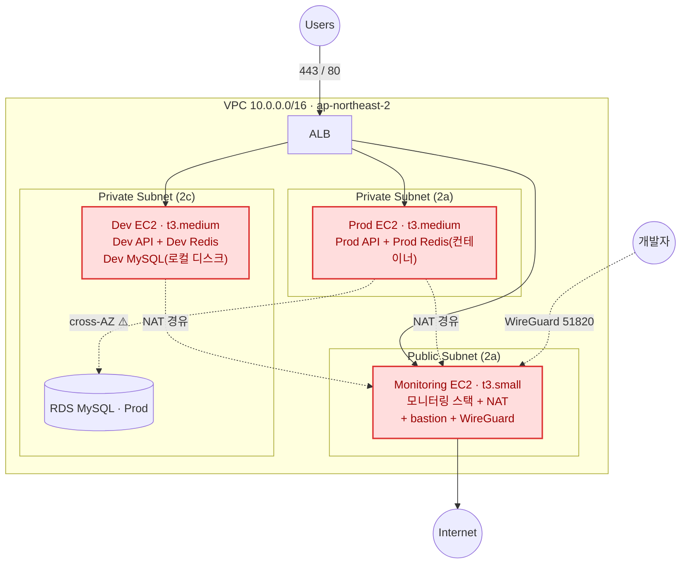
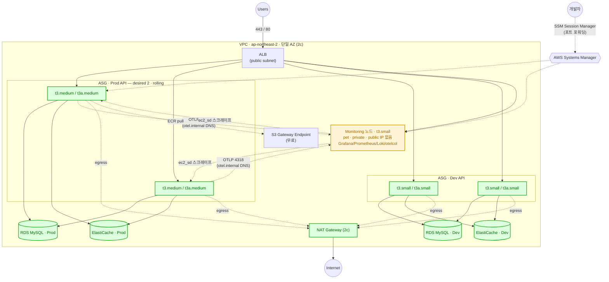

# EC2 다중화 · 무중단 하드웨어 교체 인프라 개선 설계

> 목표: Prod/Dev를 **단일 EC2(pet) 구조**에서 **ASG 기반 다중 인스턴스(cattle) 구조**로 전환하여,
> **하드웨어 보안 패치/인스턴스 교체를 다운타임 없이** 수행한다.
> 부수적으로 stateful 싱글턴을 외부화하고, 모니터링/NAT의 SPOF를 제거하며, 배포를 단순화한다.

작성 맥락: 2026-08. 신규 협업자가 "무엇을·왜" 바꾸는지 파악할 수 있도록 결정과 근거를 함께 남긴다.

## 함께 보는 문서

| 문서 | 내용 |
|---|---|
| **본 문서** | 무엇을 왜 바꾸는가 (설계와 결정 근거) |
| [`infra-ha-migration-runbook.md`](./infra-ha-migration-runbook.md) | 어떤 순서로 안전하게 이관하는가 (목차·공통 원칙, Phase별 상세는 [`runbook/`](./runbook/)) |
| [`infra-future-improvements.md`](./infra-future-improvements.md) | 이번 범위 밖이지만 이후에 다뤄야 할 항목 |

## 개정 이력

| 개정 | 변경 |
|---|---|
| v1 (초안) | ASG 전환, NAT GW, ElastiCache, Mac Mini 외부화, rolling 전환 |
| v2 | 12개 기술 결정 확정. 주요 변경: 노드당 태스크 상한의 근거를 메모리→**ENI**로 정정 · **Capacity Provider managed draining 추가**(v1 누락, 목표 달성의 핵심 메커니즘) · **AZ를 2c로 정렬**(RDS와 어긋나 있었음) · **Mac Mini 계획 폐기**(Dev를 AWS 관리형으로) · Redis 근거 정정(캐시 아님, 결제 상태) · **SSM Session Manager 도입**(bastion·WireGuard 폐기) · 서비스 디스커버리·state backend·Grafana as-code 추가 |
| **v3 (현재)** | 리뷰 반영. **Redis 엔드포인트 전환은 stop-first**(rolling 시 split-brain, §2.3) · ElastiCache를 **replication_group 리소스로 생성**(replica 추가가 온라인 변경이 되도록) · OTLP 엔드포인트를 **private DNS로 간접화**(§2.4) · rolling 전환 차단 조건에 **앱 측 작업 명시**(§3, §4) · ASG 복구 시간 추정치 보수화 · `ec2_sd` 태그 전파 조건 · capacity provider 연결 시 Terraform 함정 · WireGuard 즉시 축소 · state 버킷 접근 통제 · **비용 총괄(§2.8) 신설** · 트래픽 기준선 수집 To-Do |

---

## 0. 이 개선의 주된 목적 (Scope)

**주 목표**: 서버 한 대가 죽는 것을 정상으로 가정하고, 여러 대를 두어 **순차적으로 하드웨어를 교체해도 무중단**인 구조.

**부수 목표**: **노드 설정의 코드-실물 일치(configuration drift 제거).**
현재는 `lifecycle { ignore_changes = [user_data] }`로 부팅 스크립트 변경이 실물에 반영되지 않아, "코드에는 있는데 서버에는 없는" 설정이 존재할 수 있다. Launch Template + instance refresh로 전환하면 노드 설정 변경이 정상적으로 롤아웃된다. 과거 Loki S3 적재 실패(credential 프록시 iptables 누락)가 이 문제의 사례다.

### 명시적 비목표 (이번 범위 밖)

| 비목표 | 이유 |
|---|---|
| **멀티 AZ / AZ 장애 생존** | 비용 대비 목적 불일치. 단일 AZ로 간다. |
| **동적 오토스케일링** | 처음엔 고정 크기 ASG. 트래픽 변동이 실측으로 확인되면 이후 도입. |
| **모니터링 노드의 무중단 교체** | 관측 평면 단절은 서비스 가용성에 영향이 없다. 모니터링 노드는 pet으로 남기고, 교체는 계획된 유지보수로 처리한다. |
| **관측 평면의 HA** | 위와 같은 이유. 대신 관측이 죽어도 페이징은 살아있도록 CloudWatch 알람 백스톱을 둔다(§2.4). |

> 핵심 구분: **"무중단 하드웨어 교체"와 "AZ 장애 생존"은 다른 목표다.**
> 전자는 여러 인스턴스만으로 달성되며 단일 AZ로 충분하다. 후자(멀티 AZ)는 이번에 하지 않는다.

---

## 1. 현재 상태 (As-Is)

| 구성 | 현재 |
|---|---|
| Prod | 1× t3.medium (Private **2a**), 정적 IP, `aws_instance` 개별 관리, **API 태스크 1개** |
| Dev | 1× t3.medium (Private 2c), 정적 IP |
| Monitoring | 1× t3.small (Public 2a) — 모니터링 스택 + **NAT 인스턴스 + bastion + WireGuard VPN 겸직** |
| Prod RDS | MySQL 8.0 단일 AZ, **실제 배치는 2c** |
| Prod Redis | ECS host-mode 단일 컨테이너 (인메모리) |
| Dev MySQL | ECS host-mode 컨테이너, **데이터가 인스턴스 로컬 디스크** `/opt/mysql-dev-data` |
| Dev Redis | ECS host-mode 단일 컨테이너 |
| 아웃바운드 | Monitoring EC2가 NAT 역할(`source_dest_check=false` + iptables MASQUERADE) |
| 개발자 접근 | WireGuard(UDP 51820, `0.0.0.0/0` 개방) → VPN 서브넷 `10.6.0.0/24` → SSH(22) |
| 배포 | CodeDeploy **Blue/Green** (`ECSAllAtOnce`, `WITH_TRAFFIC_CONTROL`) + 자동 롤백 |
| Terraform state | **로컬 파일** (S3 backend 주석 처리) |

### 현재 구조의 취약점

**v1에서 식별한 것**

1. Prod/Dev 각 1대 → 인스턴스를 건드리는 순간(패치/교체) **무조건 다운타임**.
2. Monitoring EC2가 **NAT·bastion·VPN까지 겸직** → 죽으면 Prod/Dev의 아웃바운드(ECR pull, SSM 등)와 개발자 접근이 통째로 끊기는 SPOF.
3. Dev MySQL 데이터가 **노드 로컬 디스크** → 노드를 늘리거나 재배치되면 DB 유실.

**v2에서 추가로 식별한 것**

4. **Prod EC2(2a)와 RDS(2c)의 AZ가 어긋나 있다.** 현재도 모든 DB 쿼리가 cross-AZ로 나간다. 비용과 지연 양쪽에서 손해다.
5. **Terraform state가 로컬 단일 사본이다.** 잠금·이력·백업이 없고, 신규 협업자가 state를 받을 방법이 없다. `environments/shared/`에 타임스탬프 백업이 2개 남아 있어 과거 수동 복구 흔적으로 보인다.
6. **엔드포인트가 인스턴스 사설 IP에 하드코딩되어 있다.** OTLP 엔드포인트, Redis 호스트, Prometheus 스크레이프 타깃이 모두 고정 IP에 묶여 있어 ASG 전환 시 전부 깨진다.
7. **노드 부트스트랩이 반복 실행에 견디지 못한다.** ECS 에이전트 태그 미고정(`:latest`), credential 프록시 iptables/sysctl이 재부팅에 미영속, 에이전트 사망 시 좀비 노드(`--restart=on-failure:10`), `ECS_RESERVED_MEMORY=64`(실제 오버헤드의 1/8).
8. **비밀값이 태스크 정의 환경변수에 평문으로 들어 있다.** Terraform state·태스크 정의 JSON·ECS 콘솔에 그대로 남는다.
9. **Grafana 대시보드·알림 규칙이 코드에 없다.** 노드 로컬 SQLite(`/opt/grafana/data`)에만 존재해 노드 교체 시 전부 사라진다.
10. **`memoryReservation`이 실제 사용량보다 크게 낮다**(500 vs 실측 ~1200MB). ECS 스케줄러가 노드당 태스크를 과다 배치할 수 있다.

---

## 2. 목표 상태 (To-Be)

### 2.1 컴퓨트 / ASG

| 구성 | To-Be |
|---|---|
| 관리 방식 | **고정 크기 ASG** + 자가복구 + **instance refresh**(롤링 교체), 정적 IP 폐기 |
| AMI | **ECS-optimized AMI (Amazon Linux 2023)**, AMI ID는 SSM Parameter(`/aws/service/ecs/optimized-ami/.../recommended`)로 참조 |
| Prod API | **2× t3.medium** (mixed instances: `t3.medium` / `t3a.medium`) |
| Prod Monitoring | **1× t3.small pet 노드** (ASG 아님, Private 배치) |
| Dev API | **2× t3.small** (mixed instances) |
| Monitoring/NAT 겸용 EC2 | **제거** |

#### 태스크 밀도의 상한은 메모리가 아니라 ENI다

v1은 노드당 2태스크의 근거를 메모리로 설명했으나, 실제 상한은 **ENI**다. `network_mode = "awsvpc"`는 태스크당 ENI 1개를 소비하고, t3 계열은 인스턴스 크기와 무관하게 ENI가 3개다.

| 타입 | 최대 ENI | 인스턴스 primary | **태스크용 가용 ENI** |
|---|---|---|---|
| t3.small / t3.medium / t3.large | 3 | 1 | **2** |
| t3a.medium / t3a.large | 3 | 1 | **2** (t3 와 동일 — mixed instances 안전) |
| **t3a.small** | **2** | 1 | **1** ⚠️ |

> ⚠️ **`t3a.small` 만 ENI 가 2개다** (2026-08-30 실측). t3a 계열이 t3 와 동일하다는 것은
> medium 이상에서만 참이다. **[런북 Phase 7](./runbook/phase-07-dev-cache-asg.md) 에서 dev 를 t3.small 2대로 만들 때 비용을 이유로
> t3a.small 로 바꾸면 dev API(awsvpc)가 노드당 1개만 배치된다** — 계획한 배포 시퀀스가 깨진다.
> 반면 host 모드만 도는 모니터링 노드에는 무해하다.

따라서 **노드당 API 태스크는 최대 2개**이며, 메모리를 줄이거나 타입을 키워도 늘지 않는다.

**Prod 슬롯 계산 (2노드 × 2슬롯 = 4)**

| 상황 | 슬롯 사용 | 여유 |
|---|---|---|
| 평상시 (desired 2) | 2 / 4 | 2 |
| 배포 중 (max 150% = 3태스크) | 3 / 4 | 1 |
| **노드 1대 상실** | 2 / 2 | **0** |
| 노드 1대 상실 + 배포 시도 | 3 필요 / 2 가능 | **배포 불가** ⚠️ |

> **알려진 제약(수용)**: 노드 1대를 잃은 상태에서는 배포할 수 없다. ASG가 새 노드를 띄울 때까지 대기한다. **이 창은 실측 전 추정으로 3~5분 이상**이다 — EC2 헬스체크 실패 감지(기본 유예 포함) → 종료 → 기동 → ECS 에이전트 등록 → 태스크 배치까지의 합이며, "인스턴스 부팅 시간"만으로 산정하면 과소평가된다. ECS-optimized AMI 채택으로 부팅 구간은 v1 대비 크게 줄었지만 감지·등록 구간은 그대로다. 런북 [Phase 9](./runbook/phase-09-prod-asg.md)에서 실측한 뒤 이 값을 갱신한다. 필요해지면 `desired`를 3으로 올려 N+1을 확보한다 — ASG이므로 값 하나만 바꾸면 된다.

**메모리 설정**

| 항목 | 현재 | To-Be | 이유 |
|---|---|---|---|
| `api_memory_reservation` | 500 | **1000** | ECS는 hard limit이 아니라 reservation으로 배치를 결정한다. 500이면 노드당 6태스크까지 배치 가능하다고 오판한다 |
| `api_memory_limit` | 1500 | 1500 (유지) | 2태스크 × 1500 = 3000MB로 t3.medium 가용치(~3.3GiB) 안 |
| `ECS_RESERVED_MEMORY` | 64 | **512** | OS + 에이전트 + node-exporter + cAdvisor의 실제 오버헤드 반영 |

#### Dev 용량 — Prod와 다른 롤링 전략을 쓴다

t3.small(2GiB)은 API 태스크를 **노드당 1개**만 담을 수 있다. 따라서 Prod와 같은 surge 방식(`100 / 150`)을 쓸 수 없고, 축소 우선 방식을 쓴다.

**t3.small 메모리 예산**

| 항목 | 값 |
|---|---|
| 물리 2048 MiB → 리눅스 가용 | 약 1900 MiB |
| OS + ECS 에이전트 + containerd (`ECS_RESERVED_MEMORY`) | 512 |
| node-exporter (DAEMON, task memory) | 128 |
| cAdvisor (DAEMON, task memory) | 256 |
| **API 태스크 가용** | **약 1000 MiB** |

| 항목 | Dev 설정 | 비고 |
|---|---|---|
| `dev_api_memory_reservation` | **800** | 현재 500 |
| `dev_api_memory_limit` | **900** | 현재 1500 — 1200으로 두면 실피크에서 물리 메모리를 넘어 OOM 위험 |
| `desired_count` | 2 | |
| `minimumHealthyPercent` / `maximumPercent` | **50% / 100%** | 노드당 1태스크 유지 |

배포 시퀀스: `구2:신0 → 1:0 → 1:1 → 0:1 → 0:2`
(구버전을 먼저 내리고 신버전을 띄우므로 배포 중 용량이 절반으로 떨어진다 — Dev이므로 수용)

**Dev promote 게이트에서 검증되는 것과 안 되는 것** (§3-5 연계)

| 검증됨 | 검증 안 됨 |
|---|---|
| 버전 공존 (1:1 구간 존재) | **surge 배치** — Prod에서 3번째 태스크가 슬롯에 들어가는 동작 |
| graceful drain · deregistration 정렬 | 피크 시점의 노드 메모리·ENI 압력 |
| readiness 헬스체크 | |
| 서킷 브레이커 롤백 | |

배포 안전성의 핵심은 그대로 검증된다. surge 배치는 Prod 전환 시 instance refresh 리허설에서 실측한다(런북 [Phase 9](./runbook/phase-09-prod-asg.md)). Dev를 t3.medium으로 올리면 Prod와 동일 전략을 쓸 수 있으나 월 $38가 추가되며, 그 예산은 Prod의 N+1 노드나 ElastiCache replica에 쓰는 편이 낫다고 판단했다.

> `dev_api_memory_limit = 900`은 **Prod 실측(1200)에서 유추한 값이며 Dev 프로파일의 실사용량은 아직 측정되지 않았다.** 전환 후 실측하여 조정한다. 여유가 부족하면 cAdvisor task memory를 256 → 160으로 조여 100 MiB를 확보할 수 있다.

#### 하드웨어 교체를 실제로 무중단으로 만드는 것 — Capacity Provider

**ASG instance refresh만으로는 ECS 태스크가 드레인되지 않는다.** 순수 instance refresh는 EC2를 종료시키고, 그 위 태스크는 in-flight 요청과 함께 죽는다. v1에는 이 사실이 빠져 있었다.

필요한 구성:

- **ECS Capacity Provider + Managed Instance Draining (`managed_draining = "ENABLED"`)**
  ASG 종료 라이프사이클 훅이 컨테이너 인스턴스를 DRAINING으로 전환하고, 태스크가 다른 노드로 옮겨간 뒤에 인스턴스를 종료한다.
- **instance refresh는 launch-before-terminate** (`MaxHealthyPercentage = 200`)
  새 노드를 먼저 띄운 뒤 옛 노드를 뺀다. §2.1의 "임시 scale-out(+1) → drain → 종료 → 축소" 패턴이 자동화된다.

현재 코드에는 capacity provider가 전혀 없다(`capacity_provider_strategy: []`). 신규 도입 항목이다.

> ⚠️ **순서 의존성 — 서비스에 CP를 나중에 붙이는 변경은 Terraform 함정이 될 수 있다.**
> 배포 컨트롤러 전환(§2.6, 런북 Phase 6)에서 만드는 신 ECS 서비스는 CP가 아직 없으므로 launch type으로 생성된다. 이후 ASG 전환([런북 Phase 7](./runbook/phase-07-dev-cache-asg.md) dev → [Phase 9](./runbook/phase-09-prod-asg.md) prod)에서 이 서비스에 `capacity_provider_strategy`를 추가하는 변경은 **AWS provider 버전에 따라 서비스 재생성(destroy → create)을 강제할 수 있다.** §2.6의 `deployment_controller`와 같은 종류의 함정이다.
> - 이 변경을 apply하기 전 **plan에 서비스 replace가 없는지 육안 확인**한다. **Dev([런북 Phase 7](./runbook/phase-07-dev-cache-asg.md))에서 먼저 겪으므로 Prod([Phase 9](./runbook/phase-09-prod-asg.md)) 판단의 근거가 거기서 나온다.**
> - CP 전략을 붙이지 않은(launch type) 서비스의 태스크도 컨테이너 인스턴스가 DRAINING이 되면 정상적으로 옮겨진다. 따라서 CP 전략 부착이 재생성을 요구하면 **부착을 미루고 managed draining만으로 운용**해도 무중단 교체 목표는 달성된다. 이 경우 CP 전략 부착은 다음 서비스 재생성 기회로 이관한다.
> - instance refresh 리허설([런북 Phase 7](./runbook/phase-07-dev-cache-asg.md) 10번 → [Phase 9](./runbook/phase-09-prod-asg.md) 10번)에서 실제 드레인 동작을 확인하는 항목이 이 판단의 근거가 된다.

#### 용량 확보 실패에 대한 대비

고정 크기 ASG가 단일 AZ·단일 타입에 묶이면, 그 조합의 여유 용량이 없을 때(`InsufficientInstanceCapacity`) **ASG가 인스턴스를 아예 띄우지 못한다.** AZ 전체 장애보다 자주 발생하고, 하필 노드를 교체하려는 순간에 나타난다.

→ **mixed instances policy**로 `t3.medium` + `t3a.medium`을 등록한다. t3a도 4GiB / ENI 3개로 용량 계산이 동일하고, 단가는 약 10% 저렴하다. cross-AZ 비용이나 지연을 만들지 않으면서 이 리스크만 정확히 겨냥한다.

---

#### 트래픽·자원 기준선 (실측, 2026-08-10 ~ 08-16)

> Phase 1의 To-Do 9. **1주를 기다려 수집한 것이 아니라 CloudWatch 보관 데이터에서 뽑았다**
> (ALB 지표는 5분 해상도 63일 / 1시간 455일 보관). 용량 결정의 근거가 되는 값들이다.
> 재현: `RequestCountPerTarget`·`TargetResponseTime`은 prod 타깃그룹 차원,
> CPU·메모리는 `AWS/ECS` 서비스 지표(Container Insights 없이도 발행된다).

**요청량 (prod)**

| 항목 | 실측 |
|---|---|
| 7일 합계 | 507,841 건 |
| 시간당 평균 / 최대 | 3,363 / 6,365 건 |
| 초당 평균 / 피크 | **0.93 / 1.77 req/s** |
| **피크/평균 비율** | **1.89배** |
| 피크 시간대 (KST) | 22시, 14시, 13시, 16시, 23시 |
| 최저 시간대 (KST) | 5시, 4시, 6시 |
| dev 요청량 | prod의 **2.7%** (7일 13,672건) |

**응답시간 (prod, 일별)**

p50은 7일 내내 **0.047~0.055초**로 매우 안정적이다. p90도 0.067~0.110초.
p99는 평상시 0.24~0.42초인데 **2026-08-13에 4.091초로 튀었다** — 원인 미확인, 조사 대상.

**API 태스크 자원 (태스크 정의: `cpu 512` / `memoryReservation 500` / `memory 1500`)**

`AWS/ECS` 서비스 지표는 **예약값 대비 비율**이므로 절대값으로 환산해 읽어야 한다.

| | 지표값 | 환산 | 판단 |
|---|---|---|---|
| CPU | 평균 5.9% / 순간최대 377% | 평균 ~0.03 vCPU | **한참 남는다** |
| 메모리 | 평균 274% / 최대 299.8% | 평균 **~1,370 MiB** / 최대 **~1,499 MiB** | 하드 리밋 1,500 MiB에 근접 |

**14일 추가 분석 결과 — 위험 신호는 아니다.**

| 확인 항목 | 결과 |
|---|---|
| 시간별 최대치가 295% 이상(리밋 근접)인 시간 | **185/349 시간 (53%)** |
| `LiveTaskCount`가 1 미만으로 떨어진 시간 | **0/349** — 14일간 태스크 사망 0회 |
| 최소치가 급락한 15개 구간 | 전부 배포로 인한 신규 태스크 기동 (min 0%에서 시작) |

**리밋에 절반 이상의 시간 동안 닿아 있으면서 OOM 킬이 한 번도 없었다.**
이는 사용량 대부분이 **회수 가능한 페이지 캐시**임을 시사한다 — cgroup 사용량은 페이지 캐시를 포함하고,
커널은 압박 시 이를 회수하지 컨테이너를 죽이지 않는다. 실제 anonymous 메모리가 부족했다면 죽었을 것이다.
JVM 메모리 옵션이 지정되어 있지 않아 컨테이너 인식 기본값(`MaxRAMPercentage` 25% ≈ 375 MiB 힙)을 쓰는 것과도 정합한다.

**그러나 `memoryReservation = 500`은 배치(placement) 관점에서 틀린 값이다.**
ECS는 이 값으로 노드에 태스크를 배치할지 판단하는데, 실제 점유는 그보다 훨씬 크다.
`ECS_RESERVED_MEMORY=64`(실제 오버헤드 ~400-500 MiB보다 크게 낮다)와 겹치면 **노드 메모리 회계가 낙관적으로 어긋난다.**

**올바른 예약값은 CloudWatch만으로 정할 수 없다.** 필요한 것은 회수 가능한 캐시를 제외한
**실제 워킹셋**이고, 이는 cAdvisor의 `container_memory_working_set_bytes` / `container_memory_rss`로만 보인다 —
즉 **Prometheus 접근이 필요하다.**

→ **[Phase 2](./runbook/phase-02-observability.md)에서 Prometheus를 손볼 때 이 값을 함께 측정한다.**
[Phase 9](./runbook/phase-09-prod-asg.md)의 `memory_reservation` 결정(그 문서의 절차 5번)은 그 측정 결과를 기다린다.
현재 계획된 1000은 근거 없는 값이므로 그대로 적용하지 않는다.

**참고 계산** (실사용 1,370 MiB이 전부 필요하다는 최악 가정):
t3.medium(4 GiB)에 태스크 2개면 ~2.7 GiB + ECS 오버헤드(~0.5) + Redis(0.128) ≈ **3.3 GiB**로 여유가 크지 않다.
워킹셋이 이보다 작다면 여유는 늘어난다 — 그래서 측정이 필요하다.

[Phase 7](./runbook/phase-07-dev-cache-asg.md)이 dev 태스크를 `memory = 900`으로 낮추려는 계획도 같은 측정에 의존한다.

**결론 — `desired = 2`는 충분하다.** 피크가 1.77 req/s이고 피크/평균 비율이 1.89배에 불과해
트래픽 변동이 작다. 병목은 요청 처리량이 아니라 **태스크당 메모리**다.
동적 스케일링([향후 개선 Low-3](./infra-future-improvements.md#low-3))의 트리거 조건과는 아직 거리가 멀다.

#### 관측되지 않았던 과거 장애 (기준선 수집 중 발견)

**2026-08-10 09:00~09:10 UTC (18:00~18:10 KST), prod가 약 10분간 요청을 처리하지 못했다.**

| 근거 | 값 |
|---|---|
| `HTTPCode_ELB_5XX_Count` | 09:00에 71건, 09:05에 42건 (합 113건) |
| `HTTPCode_Target_5XX_Count` | 같은 시각 **0건** |
| prod green TG `HealthyHostCount` | 09:00·09:05 구간에서 **최소 0** |

Target 5xx가 0인데 ELB 5xx만 발생한 것은 **ALB가 타깃에 도달하지 못했다**는 뜻이고,
정상 타깃 수가 0으로 떨어진 것이 이를 뒷받침한다. 활성 타깃그룹이 green이었으므로 배포 전후 구간으로 추정된다.

**당시 알람이 없었으므로 아무도 알지 못했다.** 이 프로젝트가 필요한 이유의 실측 사례다.
같은 사건이 지금 발생하면 `groble-prod-no-healthy-host`와 `groble-alb-elb-5xx`가 모두 울린다.

이 외 7일간의 5xx는 **5분 구간당 1건 수준의 산발적 노이즈**였다
(ELB 5xx 14구간 중 12구간이 1건, Target 5xx는 3구간에 1~2건).

---

### 2.2 네트워크

- **단일 AZ 유지.**
- **모든 구성요소를 `ap-northeast-2c`로 정렬한다.** RDS가 실제로 2c에 있는데 Prod EC2는 2a에 있어, 현재도 모든 DB 쿼리가 cross-AZ로 나가고 있다. ASG를 새로 만드는 김에 2c로 맞추면 **현행 대비 비용과 지연이 오히려 줄어든다.**
  - Prod API ASG, Dev API ASG, 모니터링 노드, NAT GW, ElastiCache(Prod/Dev), RDS(Prod/Dev) 전부 2c
  - ASG 서브넷을 Terraform에 **명시적으로 고정**한다(현재는 인덱스 참조라 우연에 의존).
- NAT 인스턴스 → **NAT Gateway 1개** (2c). AZ 내부에서 관리형 HA → 기존 NAT 인스턴스 SPOF 소멸.
- **S3 Gateway Endpoint 추가 (무료).** ECR 이미지 레이어는 S3에서 오므로 NAT 데이터 요금의 상당 부분이 제거된다. Interface Endpoint(ecr.api/ecr.dkr/ssm/logs)는 시간당 과금이 있으므로 실제 NAT 트래픽을 보고 이후 판단한다.
- **모든 노드에서 public IP를 제거한다.** ALB만 public subnet에 남는다.

> RDS는 `multi_az = false`이고 db_subnet_group이 2a/2c를 모두 포함해 **AZ가 코드에 고정되어 있지 않다.** 향후 재생성 시 AZ가 바뀔 수 있다는 점을 인지해야 한다.

---

### 2.3 상태 저장소 외부화 (stateful 싱글턴 제거)

| 대상 | To-Be | 비고 |
|---|---|---|
| Prod Redis | **ElastiCache 단일 노드** (`cache.t4g.micro`) — 리소스는 **`aws_elasticache_replication_group`(노드 1개)** | ⚠️ 한시적 조치 — 아래 참조 |
| Dev MySQL | **RDS `db.t4g.micro`** (단일 AZ) | 로컬 디스크 컨테이너 폐기 |
| Dev Redis | **별도 ElastiCache `cache.t4g.micro`** — 동일하게 `replication_group` | Prod 노드와 공유하지 않음 |

**Redis 외부화는 선택이 아니다.** host-mode 싱글턴 컨테이너는 cattle 노드에서 주소도 데이터도 유지할 수 없다.

#### Terraform 리소스 타입은 처음부터 `replication_group`으로 만든다

단일 노드라도 `aws_elasticache_cluster`가 아니라 **`aws_elasticache_replication_group`(`num_cache_clusters = 1`, `automatic_failover_enabled = false`)** 로 생성한다.

- `aws_elasticache_cluster`로 만들면 이후 replica를 붙일 때 **리소스 재생성 = 엔드포인트 변경 = 결제 상태 2차 유실 이벤트**가 된다.
- `replication_group`으로 만들면 replica 추가·`automatic_failover_enabled` 전환이 **온라인 변경**이며 primary 엔드포인트가 유지된다. 향후 개선 문서 **Urgent #1**의 실행 비용이 이 한 줄로 결정된다.
- 앱은 `primary_endpoint_address`를 바라본다(`cluster` 리소스의 `cache_nodes[0].address`가 아님).

#### ⚠️ Redis 엔드포인트 전환은 rolling으로 하지 않는다 (stop-first)

`REDIS_HOST` 변경을 §2.6의 Prod rolling(`100% / 150%`, surge)으로 배포하면, 신 태스크가 healthy가 될 때까지 **구 태스크(컨테이너 Redis)와 신 태스크(ElastiCache)가 서로 다른 Redis를 보며 동시에 실트래픽을 받는다.** 그 몇 분 동안:

- 멱등성 키(`checkout:idempotency:*`)가 두 저장소로 갈라진다 → 재시도 요청이 다른 버전 태스크에 떨어지면 **중복 결제 방어가 실제로 뚫린다.** 문서가 수용한 "상태 유실"보다 나쁜 **"중복 처리"** 리스크다.
- 재고 예약 카운터(`stock:reserved:*`)가 두 곳에서 따로 증가한다 → 초과 판매 방어 무력화.

**원칙**: Redis 엔드포인트 변경은 **버전 공존을 허용하지 않는 변경**이다. 이 배포 1회에 한해 **stop-first**로 전환한다 — `deployment_minimum_healthy_percent`를 일시적으로 `0`으로 낮춰 구 태스크를 모두 내린 뒤 신 태스크를 띄우고, 완료 후 `100`으로 되돌린다. 저트래픽 창에서 1~2분의 순단을 추가로 감수하고 "두 개의 진실"이 공존하는 구간을 없앤다. 상태 유실은 어차피 이 전환의 전제이므로 추가 손실은 순단뿐이다.

같은 논리가 Dev Redis 전환(런북 [Phase 7](./runbook/phase-07-dev-cache-asg.md)-A)에도 적용되지만, Dev는 `50% / 100%` 축소 우선 방식이라 이미 1:1 공존 구간이 짧고 결제 정합성 요구가 없으므로 별도 조치는 하지 않는다.

> **일반화**: 어떤 외부 상태 저장소든 "권위 소스가 둘로 갈라지는" 엔드포인트 전환은 rolling 대상이 아니다. §3-1의 expand/contract 규율은 *스키마*의 공존을 다루고, 이 원칙은 *저장소 인스턴스*의 공존을 다룬다.

#### ⚠️ Prod Redis 단일 노드는 "캐시라서 안전한" 것이 아니다

v1은 근거를 *"캐시 유실이 애플리케이션에 critical하지 않음"* 이라고 적었으나, **사실과 다르다.** 애플리케이션 코드를 확인한 결과 Redis 내용물의 대부분은 캐시가 아니라 **결제 경로의 트랜잭션 상태**다.

| 키 | 용도 | 유실 시 |
|---|---|---|
| `checkout:idempotency:*` (TTL 30분) | **결제 멱등성 키** | **중복 결제 방어 소실** |
| `stock:reserved:*` (TTL 30분) | 옵션별 재고 예약 카운터. 초과 시 즉시 실패시키는 권위 소스 | 진행 중 예약 소실 → 재고 초과 판매 위험 |
| `checkout:session:*` (TTL 30분) | 체크아웃 세션 데이터 | 결제 진행 중 사용자 실패 |
| `active:sessions:*` | 활성 세션 추적 | 세션 추적 소실 |
| `email:verification:*`, `password_reset:rate:*` | 인증코드 · 레이트리밋 | 인증 재시도, 레이트리밋 우회 |
| `user:cache:*` (TTL 30분) | JWT 사용자 캐시 | **유일한 진짜 캐시** — DB 재조회로 회복 |

**따라서 단일 노드 선택의 정확한 의미는 이것이다: 노드 유지보수·장애 시 결제 경로 상태를 잃을 수 있는 창을 한시적으로 감수한다.**

단일 노드를 유지하는 동안의 필수 조건:

1. **유지보수 창을 트래픽 최저 시간대로 명시 지정**한다 (ElastiCache 기본값은 무작위 배정).
2. **자동 스냅샷을 활성화**한다.
3. **replica 도입을 최우선 개선 과제로 등재**한다 → [`infra-future-improvements.md`](./infra-future-improvements.md) **Urgent #1**.

---

### 2.4 관측 (Observability)

**Prod/Dev 모니터링은 통합 스택 하나로 유지한다.** (v1의 분리 계획은 철회)

v1은 "모니터링 스택 업그레이드를 Dev에서 먼저 검증"을 근거로 분리를 제안했으나:

- 스택을 두 벌 유지하면 대시보드·알람·설정이 이중화되어 **온보딩 부담(§4-6)이 오히려 늘어난다.**
- 환경 구분은 **이미 라벨로 되어 있다** (`environment=production` / `environment=development`).
- 업그레이드 검증의 상당 부분은 **config baking CI에 게이트를 추가**해 빌드 타임에 잡는 편이 빠르고 확실하다: `promtool check config`, Loki 설정 검증, 컨테이너 기동 스모크 테스트.
- 런타임 검증이 필요한 메이저 업그레이드는 **상시 병렬 스택 대신 일회성 임시 노드**로 처리한다.

#### 서비스 디스커버리

ASG 전환으로 노드 IP가 변하므로, 관측 경로의 주소 의존성을 정리해야 한다.

| 경로 | 방향 | To-Be |
|---|---|---|
| 앱 → otelcol (OTLP 4317/4318) | push | 모니터링 노드는 **pet으로 유지**하되, 앱은 IP가 아니라 **private DNS 이름**을 바라본다 (아래) |
| otelcol ↔ Prometheus ↔ Loki ↔ Grafana | 동일 노드 | host mode → `localhost` (변경 없음) |
| Prometheus → node-exporter(9100) / cAdvisor(8081) | **pull** | **`ec2_sd_config`로 전환** ⚠️ |

#### OTLP 엔드포인트는 private DNS로 간접화한다

모니터링 노드를 pet으로 두는 결정과 별개로, **앱 설정에 노드의 raw IP를 넣지 않는다.** Route 53 private hosted zone(월 ~$0.5)에 A 레코드를 두고 앱은 그 이름을 바라본다.

| 항목 | 값 |
|---|---|
| private hosted zone | 예: `internal.groble.im` (VPC 연결) |
| 레코드 | `otel.internal.groble.im` → 모니터링 노드 사설 IP, **TTL 60초** |
| 앱 설정 | `OTEL_EXPORTER_OTLP_ENDPOINT=http://otel.internal.groble.im:4318` |

효과:
- 모니터링 노드 재구축(런북 Phase 4)이 **레코드 값 변경으로 끝난다** — 앱 재배포가 필요 없다.
- 향후 관측 평면 HA(내부 NLB, 향후 개선 Medium-5)로 갈 때도 레코드를 NLB alias로 바꾸면 되므로 **앱 무변경**이다.
- ElastiCache 전환 전까지의 컨테이너 Redis, 향후 RDS 엔드포인트 등도 같은 패턴으로 간접화할 수 있다(선택).

> Route 53 레코드는 Terraform으로 관리한다(모니터링 노드 리소스의 `private_ip`를 참조). DNS 캐시는 TTL 이내에 갱신되지만, JVM의 DNS 캐시(`networkaddress.cache.ttl`)가 무기한이면 재배포 전까지 구 IP를 붙잡는다 — 앱 측에서 이 값이 유한한지 확인한다(§3-8).

#### `ec2_sd_config` 전환 — ASG보다 먼저

**`ec2_sd_config` 전환은 ASG 도입보다 반드시 먼저 이루어져야 한다.** 순서가 뒤바뀌면 새로 뜬 노드가 스크레이프 목록에 없어 **아무 신호 없이 관측 사각지대**에 들어간다. 타깃이 죽으면 `up=0`이 뜨지만, 애초에 목록에 없는 노드는 조용하다.

- 태그 필터(`Cluster=groble-cluster`) + relabel로 EC2 태그(`environment`, `Type`)를 라벨로 승격
- ~~Prometheus Task Role에 `ec2:DescribeInstances` 추가~~ — **이미 부여되어 있다.** 인라인 정책 `${environment}-prometheus-access`(`modules/services/monitoring/prometheus/main.tf`)에 포함. IAM 작업 불필요
- `up == 0` 알람과 **"기대 타깃 수 미달" 알람**을 함께 건다. 후자가 없으면 디스커버리 자체의 고장을 못 잡는다.
- `ec2_sd` 설정은 정적이므로 config baking과 잘 맞는다. 반대로 `static_configs`를 유지하면 노드가 바뀔 때마다 이미지를 다시 구워야 해 baking의 이점이 사라진다.

**성립 조건 — 태그가 인스턴스까지 전파되어야 한다.** `ec2_sd`는 인스턴스 태그를 본다. ASG/Launch Template에서 태그가 인스턴스로 전파되지 않으면 새 노드는 정확히 위에서 경고한 "조용한 사각지대"에 들어간다.

| 위치 | 필요한 설정 |
|---|---|
| ASG | `tag { key = "Cluster" value = "groble-cluster" propagate_at_launch = true }` — `environment`, `Type`도 동일 |
| Launch Template | 또는 `tag_specifications { resource_type = "instance" tags = {...} }` — 둘 중 하나로 통일하고 중복 정의하지 않는다 |
| 모니터링 노드 (pet) | `aws_instance`의 `tags`에 동일 키를 붙인다 (모니터링 노드 자체의 node-exporter/cAdvisor도 같은 잡으로 스크레이프) |

**"기대 타깃 수 미달" 알람의 기대값은 ASG desired와 묶는다.** 상수로 박아두면 노드 수를 바꿀 때 알람이 조용히 무의미해진다. 예: `count(up{job="node-exporter", environment="production"}) < <prod_desired>` — 값을 config baking 시 ASG 변수에서 주입하거나, 최소한 desired 변경 시 함께 바꿔야 하는 곳으로 문서화한다.

> awsvpc 태스크는 전용 ENI와 네트워크 네임스페이스를 가지므로, **태스크 안의 `localhost`는 호스트가 아니다.** "각 노드에 collector DAEMON을 두고 앱은 localhost로 보낸다"는 패턴은 이 구조에서 성립하지 않는다.

#### 관측 평면의 상태 영속화

| 구성요소 | 저장 위치 | 노드 교체 시 |
|---|---|---|
| Loki 로그 | S3 | 🟢 보존 |
| otelcol | 무상태 | 🟢 무관 |
| Prometheus TSDB | `/opt/prometheus/data` (호스트 로컬) | 🔴 15일치 시계열 유실 (수용) |
| Grafana | `/opt/grafana/data` (호스트 로컬 SQLite) | 🔴 → **as-code로 해결** |

**Grafana 대시보드·데이터소스·알림 규칙을 provisioning 파일로 코드화하고 이미지에 baking한다.** otelcol·Prometheus·Loki에 이미 적용한 패턴의 마지막 조각이다. provisioned 대시보드는 읽기 전용으로 두어 UI 편집분과 코드가 갈라지지 않게 강제한다.

Prometheus 15일치 시계열 유실은 수용한다 — 로그는 S3에 있고 시계열은 다시 쌓인다. 반면 대시보드는 사람의 축적된 작업이라 재작성에 같은 시간이 든다. 우선순위가 다르다.

> **정정**: Prometheus의 S3 버킷과 IAM 권한은 존재하지만 **실제로 사용되지 않는다**(바닐라 Prometheus는 S3에 직접 쓰지 못한다). 현재 Prometheus 데이터는 로컬 15일이 전부다. CLAUDE.md의 "S3 장기 저장(90일)" 서술은 사실과 다르며 정정 대상이다. 장기 보관은 향후 개선 항목으로 이관한다.

#### 알람 백스톱 (필수)

모니터링 노드를 pet으로 남기는 선택의 대가로, **관측 평면이 죽어도 페이징은 살아있어야 한다.**

- CloudWatch 알람 → SNS → 외부 채널 (ALB 5xx, TargetGroup `UnHealthyHostCount`, RDS 지표)
- 이는 §2.6의 **배포 서킷 브레이커가 CloudWatch 알람에 의존**하므로 어차피 필요하다.
- v1에서 "미확정"이던 항목을 **필수 스코프로 승격**한다.

또한 **OTLP export 실패가 앱 성능에 영향을 주지 않는지 확인**한다. 모니터링 노드 장애가 앱 장애로 번지는 경로를 끊어야 한다(비동기 export, 큐 포화 시 drop).

---

### 2.5 운영 / 개발자 접근 경로

**SSM Session Manager로 전면 전환한다.** (v1의 WireGuard 재활용 계획은 철회)

v1 §2.5는 "기존 WireGuard 재활용"이라고 적었으나, WireGuard 종단이 바로 §2.1에서 제거하기로 한 모니터링/NAT 노드였다. 재활용할 대상이 없어지는 모순이었다. 또한 WireGuard는 단순 터널이 아니라 **개발자의 VPC 접근 주 경로**였는데, 그 대체 수단이 계획에 없었다.

| 용도 | To-Be |
|---|---|
| 노드 접속 | `aws ssm start-session` (인스턴스 ID 기반 — 노드 IP를 몰라도 된다) |
| RDS / ElastiCache 접근 | SSM 포트 포워딩 (`AWS-StartPortForwardingSessionToRemoteHost`) |
| Grafana | ALB 경유 (`monitor.groble.im`) — 변경 없음 |

**함께 정리되는 것**

- SG에서 **22번 규칙 3곳 제거**, **WireGuard UDP 51820 제거**(현재 `0.0.0.0/0` 개방), `trusted_ips` 변수 폐기
- 키페어 `groble_prod_ec2_key_pair` 의존 제거 (launch template에서 제외)
- 인스턴스 프로파일에 `AmazonSSMManagedInstanceCore` 추가
- **SSM 세션 로그를 S3/CloudWatch로** → 현재 없는 접근 감사 기록 확보
- 자주 쓰는 포트 포워딩을 `scripts/`에 래핑 (예: `connect-rds-dev.sh`) — `scripts/`는 현재 없으며 이때 새로 만든다

ECS-optimized AL2023에는 SSM Agent가 기본 탑재되어 있어, 실제 작업은 IAM 정책 부착뿐이다. cattle 구조와도 잘 맞는다 — 노드가 교체돼도 접근 방법이 그대로다.

**선행 즉시 조치 — WireGuard 51820 소스 축소.** WireGuard 폐기는 마이그레이션 후반(런북 Phase 10, 착수 후 6~8주)이다. 그때까지 `0.0.0.0/0`으로 열린 UDP 포트를 유지할 이유가 없다. **마이그레이션 착수 전에** SG 규칙의 소스를 팀 구성원 IP 대역(또는 사무실/고정 IP)으로 좁힌다. 5분짜리 변경이고 롤백은 규칙 하나 되돌리는 것이다. 유동 IP인 팀원이 있으면 `trusted_ips` 변수에 추가하는 절차만 안내한다 — 어차피 Phase 10에서 변수 자체가 사라진다.

---

### 2.6 배포 전략: Blue/Green → **ECS 네이티브 rolling**

**결정 근거**: 결정된 슬롯 수로 검증하면 Blue/Green은 유지할 수 없다.

| 방식 | desired 2에서 필요 슬롯 | 4슬롯 플릿 |
|---|---|---|
| Blue/Green | 4 (구 2 + 신 2) | **여유 0** — 노드 1대만 잃어도 배포 실패 |
| Rolling (max 150%) | 3 | 여유 1 |

부가적으로 타깃그룹 2개 + 테스트 리스너 + CodeDeploy의 복잡도가 온보딩 장벽이었다. rolling은 피크 용량을 튜닝할 수 있고 구조가 단순하다.

| 항목 | 값 |
|---|---|
| 컨트롤러 | ECS rolling (CodeDeploy Blue/Green 폐기) |
| API desired count | **2** (현재 1 → 전환 후 증설) — Prod/Dev 동일 |
| **Prod** minimumHealthyPercent / maximumPercent | **100% / 150%** → 항상 desired 이상 유지, 피크 3태스크 (surge 방식) |
| **Dev** minimumHealthyPercent / maximumPercent | **50% / 100%** → 노드당 1태스크 (축소 우선 방식, §2.1 참조) |
| 자동 롤백 | **ECS deployment circuit breaker (rollback=true)** + CloudWatch 알람 연동 |
| **배포 주체** | **CI (GitHub Actions)** — 새 태스크 정의 등록 + `update-service`. Terraform은 `ignore_changes = [task_definition]` 유지 |

배포 주체를 Terraform으로 두면 앱 배포마다 인프라 apply가 필요해지고, state 운영(§2.7)과 겹쳐 위험하다.

#### ⚠️ 이 전환은 그냥 apply하면 다운타임이 발생한다

`aws_ecs_service`의 `deployment_controller`는 **변경 시 리소스 재생성을 강제하는 속성**이다. `CODE_DEPLOY` → `ECS`를 그대로 apply하면 Terraform이 서비스를 destroy 후 create하며, 그 사이 태스크가 0이 된다. v1에는 이 사실도 대응책도 없었다.

**무중단 컷오버**: Blue/Green을 위해 만들어 둔 **Green 타깃그룹을 재활용**한다.

1. 기존 Green TG에 rolling 방식의 **새 ECS 서비스** 생성
2. 헬스체크 통과 확인
3. ALB 리스너 규칙을 Blue TG → **Green TG로 스왑**
4. 구 서비스 + CodeDeploy 리소스 제거

**롤백은 리스너 규칙을 되돌리는 것**이며, 구 서비스가 그대로 살아 있다. 이번 마이그레이션에서 가장 깔끔한 되돌리기 지점이다. 슬롯 부족은 현재 `desired_count = 1`인 상태에서 전환해 회피한다(슬롯 2개만 사용).

상세 절차는 [`runbook/phase-06-deployment-controller.md`](./runbook/phase-06-deployment-controller.md)를 따른다.

**트레이드오프(수용함)**: 프로덕션 전 검증(테스트 리스너 9443) 상실, 롤백이 분 단위, **버전 혼재** 발생.
→ §3 릴리스 안정성 요건으로 보완한다.

---

### 2.7 Terraform 운영 기반

이번 마이그레이션의 **0단계**다. 실물 인프라를 건드리지 않으면서, 이후 모든 단계의 안전망이 된다.

| 항목 | To-Be |
|---|---|
| state backend | **S3 + 네이티브 잠금(`use_lockfile = true`)**, 버킷 versioning·암호화 |
| 환경 간 참조 | `data "terraform_remote_state"`의 `backend = "local"` 3곳을 S3로 |
| Secrets | **SSM Parameter Store SecureString + ECS `secrets` 블록** |

**왜 0단계인가**: 확정된 설계가 요구하는 state 조작이 많다 — `aws_instance` 3개 제거 → ASG 신규, Redis/MySQL 컨테이너 서비스 제거 → ElastiCache/RDS 신규, ECS 서비스 다단계 교체, SG 규칙 다수 삭제. 되돌릴 수 없는 조작을 잠금·이력·백업 없는 로컬 단일 사본 위에서 수행하는 것은 위험하다. §4-6(온보딩)의 근본 원인 하나이기도 하다.

**Secrets 전환 시 규율**: 파라미터 값을 Terraform으로 생성하면 state에 평문이 다시 들어간다. **값은 AWS CLI로 별도 생성하고 Terraform은 `data` 참조만** 한다. 태스크 정의를 건드리는 변경이므로 배포 컨트롤러 전환(§2.6)이 안정화된 뒤 별도 단계로 수행한다.

**state 버킷은 시크릿 저장소로 취급한다.** Secrets 전환(런북 Phase 11)은 마지막 단계지만 state 이전(Phase 0)은 첫 단계다. 그 사이 수 주 동안 **DB 비밀번호·Grafana admin 비밀번호가 평문으로 담긴 state가 S3에 존재한다.** 암호화만으로는 부족하며 접근 통제가 함께 있어야 한다:

- Block Public Access 4항목 전부 ON
- 버킷 정책으로 접근 주체를 Terraform 실행 role/SSO 권한 세트로 한정 (`aws:PrincipalArn` 조건), 그 외 `Deny`
- 버킷 versioning ON (실수로 덮어쓴 state 복구용) + 오래된 버전은 lifecycle로 정리하되 **최근 N개는 반드시 보존**
- 서버 측 암호화는 SSE-KMS로, 키 정책도 같은 주체로 한정 (SSE-S3보다 감사 추적이 남는다)
- CloudTrail S3 데이터 이벤트로 state 객체 read를 기록 (누가 언제 state를 내려받았는지)

Phase 11이 끝나 state에서 평문이 사라진 뒤에도 이 통제는 유지한다 — state에는 리소스 ID·엔드포인트·SG 구성 등 정찰 가치가 있는 정보가 계속 남는다.

---

### 2.8 비용 총괄 (As-Is → To-Be)

이번 전환의 월 비용 증가분을 한 곳에 모은다. 항목별 비용은 향후 개선 문서에도 흩어져 있지만, "replica $15를 아낀다" 같은 결정은 **전체 증가분 옆에 놓고 봐야** 올바르게 판단된다.

ap-northeast-2 온디맨드 기준 대략값(2026-08). 실제 청구는 Cost Explorer로 확인한다.

| 항목 | As-Is | To-Be | 증감/월 | 비고 |
|---|---|---|---|---|
| Prod API 컴퓨트 | 1× t3.medium (~$38) | 2× t3.medium/t3a (~$76) | **+$38** | 다중화의 본체 |
| Dev API 컴퓨트 | 1× t3.medium (~$38) | 2× t3.small/t3a (~$38) | 0 | 타입 하향으로 상쇄 |
| Monitoring 노드 | 1× t3.small (~$19) | 1× t3.small (~$19) | 0 | 위치·AMI만 변경 |
| NAT | 인스턴스 겸직 ($0 추가) | NAT Gateway (~$43 + 데이터 $0.059/GB) | **+$43~50** | S3 Gateway Endpoint로 ECR 레이어 트래픽 제거 |
| Prod Redis | 컨테이너 ($0) | ElastiCache `cache.t4g.micro` ×1 (~$15) | **+$15** | replica 추가 시 +$15 |
| Dev Redis | 컨테이너 ($0) | ElastiCache `cache.t4g.micro` ×1 (~$15) | **+$15** | |
| Dev MySQL | 컨테이너 ($0) | RDS `db.t4g.micro` (~$18) + 스토리지 (~$2) | **+$20** | 자동 백업 포함 |
| EBS (루트 볼륨) | 3× 기존 | 5× 30GB gp3 (~$14) | +$5 | 노드 수 증가분 |
| Route 53 private zone | — | ~$0.5 | +$0.5 | OTLP DNS 간접화 |
| S3 (state, Loki) | Loki만 | +state (무시 가능) | ~0 | |
| CloudWatch 알람 | — | ~10개 (~$1) | +$1 | 백스톱 |
| SNS | — | 무시 가능 | ~0 | |
| **합계** | | | **약 +$140~150/월** | |

**cross-AZ 비용 절감**: 현재 Prod EC2(2a)↔RDS(2c) 트래픽이 전량 cross-AZ($0.01/GB 양방향)다. 2c 정렬로 이 비용은 사라지나, 규모가 작아 위 표에서는 무시했다. Cost Explorer에서 `DataTransfer-Regional-Bytes`를 전환 전후로 비교해 실측한다.

**구매 방식으로 흡수 가능한 부분**: 컴퓨트·ElastiCache·RDS 합계 약 $180/월 중 Savings Plan / Reserved 1년 no-upfront로 약 30%(~$55/월) 절감 가능 (향후 개선 Cost-1). **구성 안정화 후** 커밋한다.

**이 표가 말하는 것**: 향후 개선 문서에서 비용을 이유로 미룬 두 항목 — ElastiCache replica(+$15)와 N+1 노드(+$38, SP 적용 시 ~+$6) — 는 전체 증가분의 10~25% 수준이며, 둘 다 이 프로젝트의 핵심 목표(무중단)와 직결된다. 예산 논의 시 이 비율로 판단한다. NAT Gateway 한 항목이 replica 세 개 값이라는 점도 참고 — Interface Endpoint 검토(향후 개선 Medium-4)와 함께 본다.

---

## 3. 롤링 배포 릴리스 안정성 요건

rolling에서는 구/신 버전이 **동시에 실트래픽**을 받으므로 아래가 전제/필수다.

1. **하위호환(expand/contract) — 필수 전제**
   - DB 스키마 · **캐시/상태 직렬화(ElastiCache)** · API 응답 · 이벤트 스키마 등 **버전 간 공유 계약은 전부 additive**.
   - 파괴적 변경은 여러 릴리스로 분할: `add → dual-write → backfill → switch reads → stop old-write → drop old`.
   - 마이그레이션은 **앱 부팅과 분리**하여 배포 전 1회 실행. 태스크마다 부팅 시 스키마 변경 금지.
   - 참고: 이 규율은 Blue/Green에서도 필요하다(DB는 버전 간 공유되는 단일 RDS). rolling은 창을 늘리고 **비선택(필수)으로 만들 뿐**.

2. **헬스체크 = 진짜 준비 상태**
   - ALB 타깃그룹 헬스체크는 **readiness**(`/actuator/health/readiness`), 컨테이너 헬스체크는 **liveness**로 분리한다.
   - **현재는 둘 다 `/actuator/health`로 구분이 없다.**
   - ECS `health_check_grace_period`로 느린 JVM 기동 중 조기 종료 방지.

3. **우아한 종료 + 드레이닝 — 숫자를 정렬해야 한다**

   | 항목 | 현재 | 문제 |
   |---|---|---|
   | TG `deregistration_delay` | **API 4개는 미설정(기본 300초)** · 모니터링만 **30초**(2026-08-30 적용) | |
   | ECS `stopTimeout` | `ECS_CONTAINER_STOP_TIMEOUT=30s` | |
   | Spring `server.shutdown` | 확인 필요 | |

   현재 정렬되어 있지 않아 **ALB가 아직 드레이닝 중인데 컨테이너가 SIGKILL될 수 있다.** 구현 시 구체 값을 확정한다(예: dereg 30s / Spring graceful 20s / stopTimeout 60s).
   순서: SIGTERM → 신규 수신 중단·in-flight 완료 → ALB 드레이닝 → 제거.

4. **서킷 브레이커 + 자동 롤백**: "떴다"가 아니라 "정상 트래픽 처리"를 보는 CloudWatch 알람(5xx·p99·에러율) 연동. §2.4의 알람 백스톱과 같은 기반을 쓴다.

5. **사전검증 공백 보완 — Dev promote 게이트**
   테스트 리스너(9443) 상실을 다음으로 갈음한다:
   - 동일 이미지를 **Dev에 먼저 배포 → 자동 스모크 테스트 통과를 Prod 승격 게이트로** 하는 promote 모델.
   - Dev가 RDS + ElastiCache + ASG로 Prod와 같은 형태가 되므로(§2.3) 이 검증이 실제로 의미를 갖는다. **Dev를 Mac Mini로 옮기지 않기로 한 핵심 이유가 이것이다.**
   - 피처 플래그(dark launch)는 더 강력하지만 애플리케이션 작업이 크다 → 향후 개선 항목.

6. **DB 커넥션 / 잡 중복**: 롤링 피크(3태스크) 총 커넥션 ≤ RDS `max_connections` 확인. 스케줄러/비동기 잡은 **멱등 또는 리더 선출**로 중복 실행 방지.

7. **세션 상태**: 세션은 외부 저장소에. **인메모리 세션 상태가 없는지** 확인.

8. **DNS 캐시**: §2.4의 OTLP DNS 간접화가 동작하려면 JVM의 DNS 캐시가 유한해야 한다. `networkaddress.cache.ttl`이 무기한(SecurityManager 하 기본값)이면 레코드를 바꿔도 재배포 전까지 구 IP를 붙잡는다. 60초 이하로 설정되어 있는지, 사용하는 HTTP 클라이언트(OTLP exporter)가 자체 커넥션 풀에서 IP를 고정하지 않는지 확인.

### rolling 전환의 차단 조건 — 앱 측 작업 (groble-backend)

위 항목 중 일부는 rolling 전환 **후에** 튜닝하는 것이 아니라, rolling이 안전하려면 **전에** 존재해야 하는 것들이다. 인프라 리포지토리 문서라 앱 의존성이 흐릿해지기 쉬우므로 여기 명시한다. **아래 4개가 모두 완료되기 전에는 런북 Phase 6(배포 컨트롤러 전환)에 진입하지 않는다.**

| # | 앱 작업 | 확인 방법 | 추적 |
|---|---|---|---|
| A | **expand/contract 마이그레이션 규율 팀 합의** (§3-1) | 합의 문서 존재. 마이그레이션이 앱 부팅과 분리되어 있는지 코드 확인 | groble-backend 이슈 # |
| B | **readiness / liveness 분리** (§3-2) — Spring `management.endpoint.health.probes.enabled=true`, `/actuator/health/readiness`가 DB·Redis 연결 상태를 반영 | 앱 기동 직후 readiness가 `OUT_OF_SERVICE`였다가 의존성 연결 후 `UP`으로 바뀌는지 | groble-backend 이슈 # |
| C | **graceful shutdown** (§3-3) — `server.shutdown=graceful`, `spring.lifecycle.timeout-per-shutdown-phase` 확정 | SIGTERM 후 in-flight 요청이 완료되고 신규 수신은 거부되는지 로컬 재현 | groble-backend 이슈 # |
| D | **드레이닝 숫자 정렬** (§3-3) — dereg delay / Spring graceful / `stopTimeout` 값 확정 | ECS는 타깃 등록 해제 → dereg delay 대기 → SIGTERM 순서로 진행하므로, `dereg delay ≥ 가장 긴 정상 요청 시간`, `Spring graceful < stopTimeout` 두 관계를 만족하는지 (예: 30s / 20s / 60s) | 인프라 + 백엔드 공동 |

이 표는 §4 To-Do 1번의 상세다. 추적 열은 실제 이슈 번호로 채운다.

---

## 4. 미확정 항목 / To-Do

| # | 항목 | 상태 |
|---|---|---|
| 1 | **rolling 전환의 앱 측 차단 조건 4건** — expand/contract 합의 · readiness/liveness 분리 · graceful shutdown · 드레이닝 값 정렬 (§3 표) | 진행 예정 — **런북 Phase 6의 차단 조건**. groble-backend 이슈와 연결 |
| 2 | ~~드레이닝 파라미터 구체 값~~ → 1번 D항목으로 통합 | — |
| 3 | **서킷 브레이커·알람 임계치 실제 값** | 구현 시 확정 |
| 4 | **Dev API 실사용 메모리 실측** | 한도는 900으로 확정(§2.1)했으나 Prod 실측값에서 유추한 값이다. Dev 전환 후 실측하여 조정 |
| 5 | **Redis 상실 시 앱 거동 검증(게임데이)** | ElastiCache 전환 후. `user:cache:` 외 항목의 유실 영향 실측 |
| 6 | ~~Prometheus 실제 S3 미사용 확인 후 CLAUDE.md 정정~~ | ✅ 완료 |
| 7 | ~~CLAUDE.md의 IAM 서술 정정~~ | ✅ 완료. **다만 방향이 반대였다** — Task Role에 `ec2:Describe*`가 "없다"는 서술이 틀렸고, 인라인 `prometheus-access`로 이미 부여되어 있다. 누락돼 있던 `AmazonSSMReadOnlyAccess`·`monitoring-*` 인라인 정책도 함께 반영했다 |
| 8 | 온보딩/히스토리 문서화 | 별도 트랙 — §2.7(state)·§2.4(Grafana as-code)로 일부 해소 |
| 9 | **트래픽 기준선 수집** — 계획서 전체에 트래픽 수치가 없고 desired 2의 근거가 메모리 실측뿐이다 | 런북 Phase 1의 1주 알람 기준선 관측 때 함께 기록: ALB `RequestCountPerTarget`·`TargetResponseTime` p99·피크 시간대·피크/평균 비율·태스크 CPU/메모리. 용량 결정의 근거이자 동적 스케일링(향후 개선 Low-3) 트리거의 데이터원 |
| 10 | **ASG 노드 복구 시간 실측** | 런북 [Phase 9](./runbook/phase-09-prod-asg.md) 노드 강제 종료 테스트에서 측정 → §2.1의 "3~5분 추정" 갱신 |
| 11 | **WireGuard 51820 소스 축소** (§2.5 선행 즉시 조치) | 마이그레이션 착수 전 |
| 12 | **JVM DNS 캐시 TTL 확인** (§3-8) | OTLP DNS 간접화 전 |
| 13 | **RDS 사양 재확인** — Prod RDS는 `db.t3.micro`(메모리 1GiB) / `20GB→100GB`다. 문서가 `db.t3.medium` / `100GB→1000GB`로 잘못 적고 있었다 | CLAUDE.md는 정정 완료. **용량 판단이 이 값에 의존하므로 Phase 1 트래픽 기준선 수집 때 RDS 지표도 함께 볼 것** |

**v1에서 해소된 항목**

| v1 To-Do | 해소 |
|---|---|
| Prod 알람 독립 실패 도메인 (미확정) | §2.4 알람 백스톱으로 **필수 스코프 승격** |
| Dev DB 백업 방침 (To-Do) | §2.3 RDS 전환으로 **자동 해소** (RDS 자동 백업) |
| Mac Mini 터널(WireGuard) 상세 구성 | §2.5 SSM 전환으로 **항목 소멸** |
| Dev API 용량 재산정 | §2.1에서 `reservation 800 / limit 900`, `50% / 100%`로 **확정** |

---

## 5. 아키텍처 시각화

### 5.1 As-Is

> 🔴 붉은 노드 = **단일 인스턴스 = SPOF**. 특히 Monitoring EC2는 NAT·bastion·VPN까지 겸직하여, 죽으면 Prod/Dev 아웃바운드와 개발자 접근이 함께 끊긴다.
> ⚠️ Prod EC2(2a)와 RDS(2c)의 AZ가 어긋나 모든 DB 쿼리가 cross-AZ로 나간다.

### 5.2 To-Be

> 🟢 다중 인스턴스(ASG) + 관리형 NAT/캐시/DB → 한 대씩 무중단 교체 가능, NAT SPOF 제거.
> 🟡 모니터링 노드는 **의도적으로 pet으로 남긴다**(§0 비목표). 교체는 계획된 유지보수로 처리하고, 관측 단절에 대비해 CloudWatch 알람 백스톱을 둔다.
> 전 구성요소가 **2c 단일 AZ**에 정렬되어 cross-AZ 비용·지연이 제거된다. 노드에 public IP가 없고, 접근은 SSM으로만 이루어진다.
> 앱 → 모니터링 노드는 IP가 아니라 **private DNS**(`otel.internal.*`)로 연결되어, 모니터링 노드 교체가 앱 재배포 없이 끝난다.

---

## 6. 확정 결정 요약 (한눈에)

### 컴퓨트
- ✅ 고정 크기 ASG + 자가복구 + instance refresh (동적 스케일링은 추후)
- ✅ **ECS Capacity Provider + Managed Instance Draining** — 무중단 교체의 실제 메커니즘
- ✅ instance refresh는 **launch-before-terminate** (`MaxHealthyPercentage = 200`)
- ✅ **ECS-optimized AMI (AL2023)**, AMI ID는 SSM Parameter 참조
- ✅ Prod: API 2× t3.medium + 모니터링 1× t3.small(pet)
- ✅ Dev: API 2× t3.small
- ✅ **mixed instances policy** (t3 / t3a) — 용량 확보 실패 대비
- ✅ **노드당 태스크 상한은 ENI로 2개** — 총 4슬롯, desired 2, 롤링 피크 3
- ✅ `memory_reservation` 500 → **1000**, `ECS_RESERVED_MEMORY` 64 → **512**
- ⚠️ **알려진 제약**: 노드 1대 상실 중에는 배포 불가 (ASG 복구까지 **실측 전 추정 3~5분+**, [Phase 9](./runbook/phase-09-prod-asg.md)에서 실측)
- ⚠️ 서비스에 CP 전략을 후속 부착하는 변경은 **재생성을 강제할 수 있음** — plan 육안 확인, 필요 시 managed draining만으로 운용

### 네트워크
- ✅ 단일 AZ 유지, **전 구성요소를 2c로 정렬** (RDS와 어긋나 있던 것 교정)
- ✅ NAT 인스턴스 → **NAT Gateway 1개** (2c)
- ✅ **S3 Gateway Endpoint** 추가 (무료, ECR pull 비용 절감)
- ✅ 모든 노드에서 **public IP 제거**

### 상태 저장소
- ✅ Prod Redis → **ElastiCache 단일 노드** (한시적 — replica 전환이 Urgent #1), 리소스는 **`replication_group`** 으로 생성해 replica 추가가 온라인 변경이 되게 함
- ✅ **Redis 엔드포인트 전환은 stop-first** — rolling 시 멱등성 키·재고 카운터 split-brain
- ✅ Dev MySQL → **RDS `db.t4g.micro`**, Dev Redis → **별도 ElastiCache**
- ✅ **Mac Mini 계획 폐기** — Dev가 Prod를 대변해야 §3-5의 검증이 성립

### 관측
- ✅ **통합 모니터링 스택 유지** (Prod/Dev 분리 철회), 환경은 라벨로 구분
- ✅ Prometheus **`ec2_sd_config`** 전환 — **ASG 도입보다 선행**, ASG/LT **태그 전파** 필수, 기대 타깃 수 알람은 desired와 연동
- ✅ **Grafana 프로비저닝 as-code** (config baking 확장)
- ✅ **CloudWatch 알람 백스톱 필수화** (v1의 "미확정"에서 승격)
- ✅ 모니터링 노드는 pet 유지, OTLP 엔드포인트는 **private DNS**(`otel.internal.*`)로 간접화 — 노드 교체 시 앱 무변경

### 운영
- ✅ **SSM Session Manager** — bastion·WireGuard·22번·키페어 전부 폐기, 세션 감사 로그 확보
- ✅ **WireGuard 51820 소스를 착수 전 즉시 축소** (`0.0.0.0/0` → 팀 IP)

### 배포
- ✅ **ECS rolling** — Prod: desired 2, `100% / 150%`(surge) / Dev: desired 2, `50% / 100%`(축소 우선), 서킷 브레이커 롤백
- ✅ **Phase 6 진입 차단 조건 = 앱 측 4건** (expand/contract · readiness/liveness · graceful shutdown · 드레이닝 값) — §3 표, groble-backend 이슈와 연결
- ✅ Dev 메모리: `reservation 800 / limit 900` (t3.small 예산 ~1000MiB 기준)
- ✅ 컷오버는 **Green TG 재활용 + 리스너 스왑** (서비스 재생성으로 인한 다운타임 회피)
- ✅ **배포 주체는 CI** — Terraform은 `ignore_changes = [task_definition]` 유지

### 기반
- ✅ **S3 backend + 네이티브 잠금** — 마이그레이션 0단계. state 버킷은 **시크릿 저장소로 취급**(Block Public Access · 주체 한정 정책 · SSE-KMS · CloudTrail 데이터 이벤트)
- ✅ Secrets → **SSM Parameter Store** (배포 전환 안정화 후 별도 단계)
- ✅ **비용 총괄 §2.8** — 전환으로 약 +$140~150/월, 미룬 항목(replica·N+1)은 그중 10~25%
