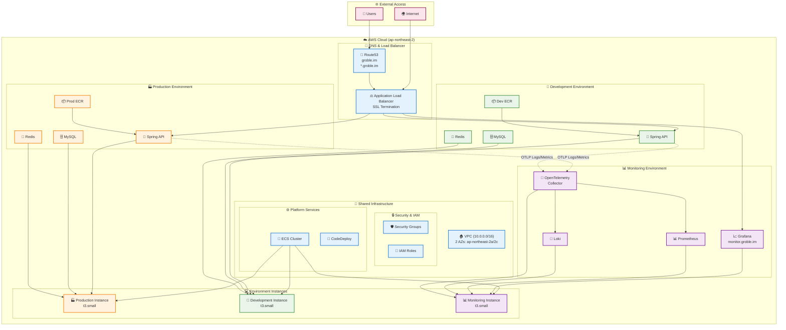

# Groble Infrastructure - Environment Management

Groble 인프라의 환경별 설정을 관리하는 Terraform 프로젝트입니다. 공유 인프라 위에 개발, 프로덕션, 모니터링 환경을 체계적으로 구성합니다.

## 🏗️ 전체 아키텍처 개요



## 📁 폴더 구조

```
environments/
├── shared/                    # 🏢 공유 인프라 (기반 플랫폼)
│   ├── main.tf               # VPC, IAM, ALB, ECS 클러스터, EC2 인스턴스
│   ├── terraform.tfvars      # 공유 환경 설정값
│   ├── variables.tf          # 변수 정의
│   ├── versions.tf           # Provider 버전
│   └── outputs.tf            # 다른 환경에서 참조할 출력값
├── monitoring/               # 📊 모니터링 환경 (관측성 스택)
│   ├── main.tf              # Grafana, Prometheus, Loki, OpenTelemetry
│   ├── terraform.tfvars     # 모니터링 환경 설정값
│   ├── variables.tf         # 모니터링 변수 정의
│   ├── versions.tf          # Provider 버전
│   └── README.md            # 상세 모니터링 가이드
├── dev/                     # 🔧 개발 환경 (서비스 계층)
│   ├── main.tf             # 개발 환경 메인 설정
│   ├── terraform.tfvars    # 개발 환경 변수 값
│   ├── variables.tf        # 개발 환경 변수 정의
│   └── versions.tf         # Terraform & Provider 버전
└── prod/                   # 🏭 프로덕션 환경 (서비스 계층)
    ├── main.tf            # 프로덕션 환경 메인 설정
    ├── terraform.tfvars   # 프로덕션 환경 변수 값
    ├── variables.tf       # 프로덕션 환경 변수 정의
    └── versions.tf        # Terraform & Provider 버전
```

## 🚀 배포 가이드

> **⚠️ 중요**: 반드시 아래 순서대로 배포해야 합니다!

### 1단계: 공유 인프라 배포 (필수 선행 작업)

모든 환경의 기반이 되는 공유 인프라를 배포합니다.

```bash
# 공유 환경 폴더로 이동
cd environments/shared

# Terraform 초기화
terraform init

# 계획 확인
terraform plan

# 배포 실행
terraform apply
```

**배포 내용**: VPC, 보안 그룹, IAM 역할, Application Load Balancer, ECS 클러스터, EC2 인스턴스 3대 (prod, dev, monitoring)

### 2단계: 모니터링 환경 배포 

모든 환경의 로그와 메트릭을 수집하는 모니터링 스택을 배포합니다.

```bash
# 모니터링 환경 폴더로 이동
cd environments/monitoring

# Terraform 초기화
terraform init

# 계획 확인
terraform plan

# 배포 실행
terraform apply
```

**배포 내용**: Grafana, Prometheus, Loki, OpenTelemetry Collector

### 3단계: 개발 환경 배포

개발 및 테스트를 위한 서비스를 배포합니다.

```bash
# 개발 환경 폴더로 이동
cd environments/dev

# Terraform 초기화
terraform init

# 계획 확인
terraform plan

# 배포 실행
terraform apply
```

**배포 내용**: 개발용 ECR, Spring API, MySQL, Redis

### 4단계: 프로덕션 환경 배포

실제 운영용 서비스를 배포합니다.

```bash
# 프로덕션 환경 폴더로 이동
cd environments/prod

# Terraform 초기화
terraform init

# 계획 확인
terraform plan

# 배포 실행
terraform apply
```

**배포 내용**: 프로덕션용 ECR, Spring API, MySQL, Redis

## 🔧 환경별 상세 정보

### 🏢 Shared Environment (shared/)

**역할**: 모든 환경에서 공유하는 기반 인프라

**주요 리소스**:
- **VPC**: 10.0.0.0/16 (2개 AZ)
- **Application Load Balancer**: SSL 터미네이션 및 트래픽 분산
- **ECS 클러스터**: groble-cluster
- **EC2 인스턴스**: 
  - Production Instance (t3.small) × 1
  - Development Instance (t3.small) × 1  
  - Monitoring Instance (t3.small) × 1
- **CodeDeploy**: Blue/Green 배포 지원
- **Route53**: groble.im 도메인 관리

**핵심 출력값**:
```hcl
vpc_id                = "vpc-xxxxx"
ecs_cluster_id        = "arn:aws:ecs:region:account:cluster/groble-cluster"
monitoring_target_group_arn = "arn:aws:elasticloadbalancing:..."
```

### 📊 Monitoring Environment (monitoring/)

**역할**: 통합 관측성 및 모니터링 스택

**접근 주소**: https://monitor.groble.im

**주요 서비스**:
- **Grafana** (0.25 vCPU, 256MB): 통합 대시보드 및 시각화
- **Prometheus** (0.5 vCPU, 512MB): 메트릭 수집 및 시계열 데이터베이스
- **Loki** (0.5 vCPU, 256MB): 로그 수집 및 저장 (S3 백엔드)
- **OpenTelemetry Collector** (0.25 vCPU, 256MB): 텔레메트리 데이터 처리

**데이터 보관 정책**:
- **로그**: S3에 30일 보관
- **메트릭**: 로컬 15일 + S3 백업 90일

**통합 방법**:
```yaml
# Spring Boot application.yml
otel:
  exporter:
    otlp:
      endpoint: "http://localhost:4318"
```

### 🔧 Development Environment (dev/)

**역할**: 개발 및 테스트용 서비스

**주요 특징**:
- **비용 최적화**: 낮은 리소스 할당
- **빠른 반복**: 제한 없는 배포
- **개발 편의성**: 관대한 설정

**서비스 구성**:
- **Spring API**: 0.25 vCPU, 400MB (reservation) / 700MB (limit)
- **MySQL**: 0.125 vCPU, 256MB - `groble_develop_database`
- **Redis**: 0.125 vCPU, 128MB
- **ECR**: 최대 5개 이미지 보관

**환경 설정**:
```hcl
spring_profiles = "dev,common,secret-dev"
server_env = "development"
```

### 🏭 Production Environment (prod/)

**역할**: 실제 운영용 서비스

**주요 특징**:
- **고성능**: 충분한 리소스 할당
- **안정성**: Blue/Green 배포
- **보안**: 엄격한 설정

**서비스 구성**:
- **Spring API**: 0.25 vCPU, 400MB (reservation) / 700MB (limit)
- **MySQL**: 0.25 vCPU, 500MB - `groble_prod_database`
- **Redis**: 0.125 vCPU, 128MB
- **ECR**: 최대 10개 이미지 보관

**환경 설정**:
```hcl
spring_profiles = "prod,common,secret-prod"
server_env = "production"
```

## 📋 주요 설정값

### 🌍 공통 설정
- **AWS Region**: ap-northeast-2 (서울)
- **VPC CIDR**: 10.0.0.0/16
- **가용영역**: ap-northeast-2a, ap-northeast-2c
- **프로젝트**: groble
- **Key Pair**: groble_prod_ec2_key_pair

### 🔒 SSL 인증서
```hcl
ssl_certificate_arn = "arn:aws:acm:ap-northeast-2:538827147369:certificate/fb1a8d16-e96b-4faa-af6f-c55769cd35f9"
additional_ssl_certificate_arn = "arn:aws:acm:ap-northeast-2:538827147369:certificate/6045ac57-47f5-4675-b0d4-d74a1b55171a"
```

### 🎯 도메인 구성
- **메인 도메인**: groble.im
- **모니터링**: monitor.groble.im
- **운영용 API 엔드포인트**: api.groble.im 
- **개발용 API 엔드포인트**: api.dev.groble.im

## 📊 리소스 사용량 요약

| 환경 | EC2 인스턴스 | ECS 태스크 | 총 vCPU | 총 메모리 | 스토리지 |
|------|-------------|-----------|---------|----------|----------|
| **Shared** | 3 × t3.small | 0 | 0 | 0 | - |
| **Monitoring** | - | 4 | 1.5 vCPU | 1.25GB | S3 |
| **Development** | - | 3 | 0.5 vCPU | 0.78GB | Local |
| **Production** | - | 3 | 0.625 vCPU | 1.03GB | Local |
| **총합** | **3 인스턴스** | **10 태스크** | **2.6+ vCPU** | **3+ GB** | **Mixed** |

## 🔍 모니터링 통합 가이드

### Spring Boot 애플리케이션 설정

#### 1. 의존성 추가
```xml
<!-- OpenTelemetry Auto-instrumentation -->
<dependency>
    <groupId>io.opentelemetry.instrumentation</groupId>
    <artifactId>opentelemetry-spring-boot-starter</artifactId>
</dependency>

<!-- Micrometer Prometheus -->
<dependency>
    <groupId>io.micrometer</groupId>
    <artifactId>micrometer-registry-prometheus</artifactId>
</dependency>
```

#### 2. 애플리케이션 설정
```yaml
# application.yml
otel:
  service:
    name: "groble-api"
  exporter:
    otlp:
      endpoint: "http://{MONITORING_INSTANCE_IP}:4318"
      
management:
  endpoints:
    web:
      exposure:
        include: health,info,metrics,prometheus
  endpoint:
    prometheus:
      enabled: true
```

### 주요 모니터링 지표

#### 📈 애플리케이션 메트릭
- **HTTP 요청**: 응답시간, 처리량, 에러율
- **JVM 메트릭**: 메모리 사용량, GC, 스레드
- **데이터베이스**: 연결 풀, 쿼리 성능
- **비즈니스 KPI**: 주문, 사용자, 매출

#### 📝 로그 수집
- **구조화된 로그**: JSON 포맷으로 출력
- **로그 레벨**: ERROR, WARN, INFO 분리
- **트레이스 연결**: 요청별 추적 가능

### Grafana 대시보드 접근
- **URL**: https://monitor.groble.im
- **계정**: admin / [terraform.tfvars의 grafana_admin_password]
- **데이터소스**: 
  - Prometheus (메트릭): `http://localhost:9090`
  - Loki (로그): `http://localhost:3100`

## 🔐 보안 고려사항

### 네트워크 보안
- **VPC**: 격리된 네트워크 환경
- **보안 그룹**: 최소 권한 원칙
- **Private 서브넷**: 데이터베이스 및 내부 서비스
- **NAT Gateway**: 아웃바운드 인터넷 접근 제어

### 접근 제어
```hcl
trusted_ips = ["0.0.0.0/0"]  # ⚠️ TODO: 실제 사용 시 특정 IP로 제한
```

### 민감 정보 관리
- **데이터베이스 패스워드**: terraform.tfvars (Git 제외)
- **SSL 인증서**: AWS ACM 관리
- **IAM 역할**: 최소 권한 정책

## 💰 비용 최적화

### EC2 인스턴스 전략
- **Production**: t3.small (안정성 우선)
- **Development**: t3.small (개발 편의성)
- **Monitoring**: t3.small (데이터 처리 성능)

### 스토리지 최적화
- **S3 Lifecycle**: 자동 데이터 삭제
  - 로그: 30일 후 삭제
  - 메트릭: 90일 후 삭제
- **EBS**: 기본 볼륨만 사용
- **ECR**: 이미지 개수 제한 (dev: 5개, prod: 10개)

### 리소스 사용량 모니터링
```promql
# 컨테이너 메모리 사용률
container_memory_usage_bytes / container_spec_memory_limit_bytes * 100

# CPU 사용률
rate(container_cpu_usage_seconds_total[5m]) * 100
```

## 🛠️ 운영 가이드

### 배포 관리

#### 개발 환경 배포
```bash
# ECR 이미지 푸시 후
cd environments/dev
terraform apply -var="spring_app_image=<NEW_IMAGE_URI>"
```

#### 프로덕션 배포
```bash
# Blue/Green 배포 활용
cd environments/prod
terraform apply -var="spring_app_image=<PROD_IMAGE_URI>"
```

### 모니터링 상태 확인
```bash
# ECS 서비스 상태
aws ecs list-services --cluster groble-cluster

# 컨테이너 로그 확인
aws logs tail /ecs/groble-prod-api --follow

# 헬스체크 확인
curl https://api.groble.im/actuator/health
curl https://monitor.groble.im/api/health
```

### 장애 대응

#### 서비스 재시작
```bash
# 특정 서비스 강제 재배포
aws ecs update-service --cluster groble-cluster --service groble-prod-api --force-new-deployment
```

#### 로그 분석
```logql
# Grafana에서 에러 로그 검색
{service_name="groble-api"} |= "ERROR" | json | __error__ = ""
```

#### 메트릭 모니터링
```promql
# 5분간 에러율
sum(rate(http_server_requests_seconds_count{status=~"5.."}[5m])) /
sum(rate(http_server_requests_seconds_count[5m])) * 100
```

## 🚨 트러블슈팅

### 일반적인 문제

#### 1. 서비스 의존성 오류
```
Error: dependency timeout
```
**해결방법**: 배포 순서 확인 (shared → monitoring → dev → prod)

#### 2. 메모리 부족 오류
```
Container killed: OutOfMemory
```
**해결방법**: terraform.tfvars에서 메모리 할당량 증가

#### 3. SSL 인증서 오류
```
Error: certificate not found
```
**해결방법**: ACM에서 인증서 상태 확인 및 ARN 업데이트

#### 4. 모니터링 연결 실패
```
Connection refused: otelcol.groble.local:4318
```
**해결방법**: 
- 모니터링 환경이 배포되어 있는지 확인
- Service Discovery 설정 확인
- 보안 그룹 규칙 점검

### 로그 위치

#### ECS 서비스 로그
```bash
# CloudWatch Logs (비활성화됨)
# 대신 컨테이너 직접 로그 확인
aws ecs execute-command --cluster groble-cluster --task <TASK_ARN> --interactive --command "/bin/bash"
```

#### Terraform 상태
```bash
# 상태 파일 위치
ls -la */terraform.tfstate

# 출력값 확인
terraform output
```

## 📈 확장 및 업그레이드

### 수직 확장 (Scale Up)
```hcl
# terraform.tfvars에서 리소스 증가
api_memory_reservation = 800  # 400 → 800MB
mysql_memory = 1000           # 500 → 1000MB
```

### 수평 확장 (Scale Out)
```hcl
# 태스크 수 증가
api_desired_count = 2  # 1 → 2
prod_instance_count = 2  # EC2 인스턴스 추가
```

### 모니터링 고도화
- **Alertmanager**: 알림 관리 시스템 추가
- **Jaeger**: 분산 트레이싱 구현
- **Custom 대시보드**: 비즈니스 메트릭 시각화

### 보안 강화
```hcl
# 접근 IP 제한
trusted_ips = ["123.456.789.0/24"]  # 사무실 IP만 허용

# 삭제 보호 활성화
enable_deletion_protection = true
```

## 📋 배포 전 체크리스트

### 🏢 공유 환경 (shared/) - 최우선 배포!
- [ ] AWS CLI 프로파일 설정 (`groble-terraform`)
- [ ] SSL 인증서 2개 발급 완료 (메인 + 와일드카드)
- [ ] EC2 Key Pair 생성 (`groble_prod_ec2_key_pair`)
- [ ] Route53 호스팅 영역 설정 (`groble.im`)
- [ ] VPC CIDR 계획 수립 (10.0.0.0/16)
- [ ] 인스턴스 타입 결정 (t3.small × 3)

### 📊 모니터링 환경 (monitoring/)
- [ ] 공유 환경 배포 완료 확인
- [ ] Grafana 도메인 설정 (`monitor.groble.im`)
- [ ] 관리자 패스워드 설정
- [ ] S3 버킷 권한 확인
- [ ] 리소스 할당량 검토

### 🔧 개발 환경 (dev/)
- [ ] 공유 + 모니터링 환경 배포 완료
- [ ] 개발용 데이터베이스 패스워드 설정
- [ ] ECR 레포지토리 이미지 준비
- [ ] OpenTelemetry 연동 설정
- [ ] 환경변수 및 Spring 프로파일 확인

### 🏭 프로덕션 환경 (prod/)
- [ ] 모든 선행 환경 배포 완료
- [ ] 프로덕션 데이터베이스 패스워드 설정
- [ ] ECR 프로덕션 이미지 준비
- [ ] Blue/Green 배포 설정 확인
- [ ] 백업 및 복구 계획 수립
- [ ] 성능 테스트 완료

## 🎯 성공 지표

### 배포 완료 확인
```bash
# 모든 ECS 서비스 Running 상태 확인
aws ecs list-services --cluster groble-cluster

# 헬스체크 통과 확인
curl -f https://api.groble.im/actuator/health
curl -f https://monitor.groble.im/api/health

# 모니터링 데이터 수집 확인
# Grafana에서 메트릭과 로그가 정상 수집되는지 확인
```

### 성능 지표
- **응답시간**: < 500ms (95th percentile)
- **가용성**: > 99.5% (월간)
- **에러율**: < 0.1%
- **메모리 사용률**: < 80%

## 🤝 지원 및 문의

### 문서 및 가이드
- **모니터링 상세 가이드**: `/environments/monitoring/README.md`
- **Terraform 공식 문서**: https://terraform.io/docs
- **AWS ECS 가이드**: https://docs.aws.amazon.com/ecs/

---

## 🚀 Quick Start 요약

신규 환경 구성 시 다음 명령어를 순서대로 실행하세요:

```bash
# 1. 공유 인프라 (필수)
cd environments/shared && terraform init && terraform apply

# 2. 모니터링 스택 (권장)
cd ../monitoring && terraform init && terraform apply

# 3. 개발 환경
cd ../dev && terraform init && terraform apply

# 4. 프로덕션 환경
cd ../prod && terraform init && terraform apply

# 5. 상태 확인
aws ecs list-services --cluster groble-cluster
curl https://monitor.groble.im/api/health
```
