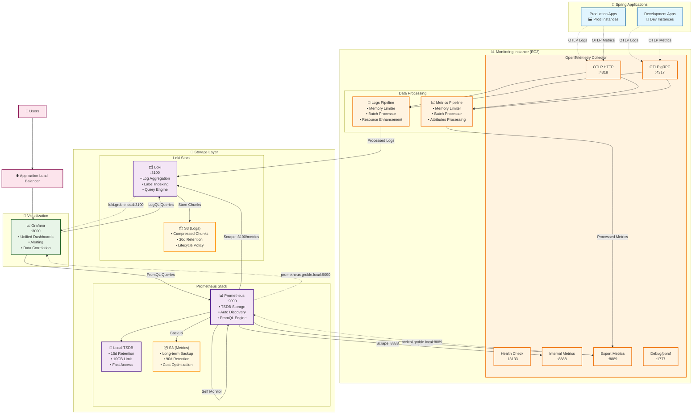
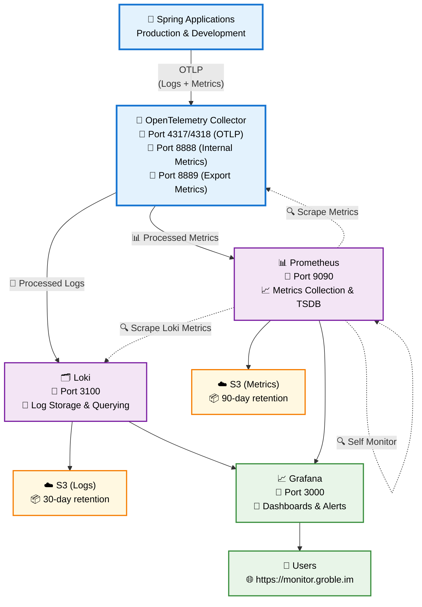
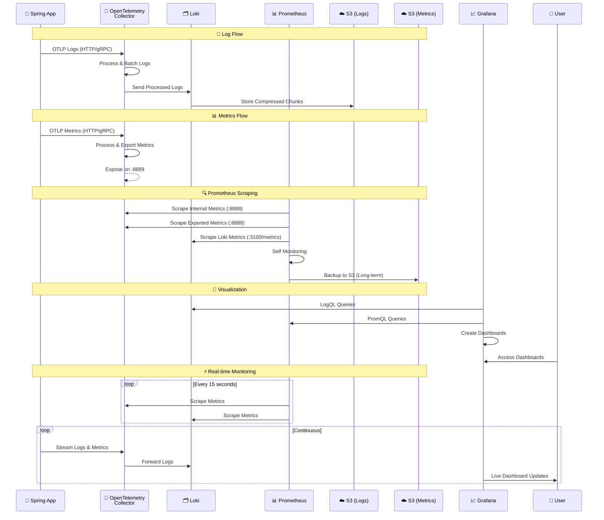

# 모니터링 환경

로그, 메트릭, 시각화를 포함한 완전한 관측성 스택 배포.

## 🏗️ 아키텍처 개요

### 완전한 시스템 아키텍처


## 📖 아키텍처 다이어그램 가이드

### 🎯 **완전한 시스템 아키텍처**
첫 번째 다이어그램은 모든 구성 요소, 포트 및 데이터 처리 파이프라인을 포함한 완전한 시스템을 보여줍니다. 포함 내용:
- **색상별 구성 요소**: 쉬운 식별을 위해 서로 다른 서비스가 색상으로 구분됨
- **상세한 포트 정보**: 모든 서비스 포트와 그 용도
- **데이터 처리 파이프라인**: OpenTelemetry를 통해 로그와 메트릭이 처리되는 방식
- **저장소 전략**: 로컬 및 S3 저장소 계층
- **서비스 디스커버리**: 내부 통신 패턴

### 🔄 **간소화된 개요** 
두 번째 다이어그램은 다음 사항에 중점을 둔 고급 보기를 제공합니다:
- **주요 데이터 흐름**: OTLP → 처리 → 저장 → 시각화
- **주요 엔드포인트**: 필수 포트 및 액세스 지점
- **저장소 보관**: 로그 대 메트릭에 대한 다른 보관 정책
- **사용자 액세스**: 사용자가 시스템과 상호 작용하는 방식

### ⏱️ **데이터 흐름 시퀀스**
시퀀스 다이어그램은 데이터의 시간적 흐름을 보여줍니다:
- **로그 처리**: 로그가 앱에서 저장소로 이동하는 방식
- **메트릭 수집**: 푸시(OTLP) 및 풀(Prometheus 스크래핑) 패턴 모두
- **실시간 작업**: 지속적인 모니터링 및 대시보드 업데이트
- **저장소 작업**: 데이터가 언제, 어떻게 지속되는지

### 🎨 **시각적 범례**
- 🚀 **애플리케이션**: Spring Boot 서비스
- 🔄 **처리**: OpenTelemetry Collector
- 🗂️ **로그 저장소**: Loki 구성 요소
- 📊 **메트릭 저장소**: Prometheus 구성 요소
- ☁️ **장기 저장소**: S3 버킷
- 📈 **시각화**: Grafana 대시보드
- 👥 **액세스**: 사용자 인터페이스

### 간소화된 개요


### 데이터 흐름 시퀀스


## 📦 배포된 서비스

### 1. **Loki** - 로그 집계
- **목적**: 중앙화된 로그 저장 및 쿼리
- **리소스**: 0.5 vCPU, 512MB RAM
- **저장소**: S3 백엔드 (30일 보관)
- **엔드포인트**: `localhost:3100`
- **기능**: 레이블 기반 인덱싱, 압축 저장

### 2. **OpenTelemetry Collector** - 데이터 처리
- **목적**: 텔레메트리 데이터 수집 및 처리
- **리소스**: 0.25 vCPU, 256MB RAM  
- **포트**: 
  - 4317 (gRPC), 4318 (HTTP): OTLP 수집
  - 8888: 내부 메트릭
  - 8889: 애플리케이션 메트릭 내보내기
  - 13133: 상태 확인
- **파이프라인**: 로그 → Loki, 메트릭 → Prometheus

### 3. **Prometheus** - 메트릭 저장소 (신규!)
- **목적**: 시계열 메트릭 수집 및 저장
- **리소스**: 0.5 vCPU, 1GB RAM
- **저장소**: 로컬 TSDB (15일) + S3 백업 (90일) 
- **엔드포인트**: `localhost:9090`
- **기능**: 자동 발견, 알림, PromQL 쿼리

### 4. **Grafana** - 시각화
- **목적**: 통합 관측성 대시보드
- **리소스**: 0.25 vCPU, 256MB RAM
- **액세스**: `https://monitor.groble.im`
- **데이터 소스**: Loki(로그) + Prometheus(메트릭)

## 🚀 빠른 시작

### 사전 요구 사항
1. **공유 환경**이 먼저 배포됨
2. `environment == monitoring` 태그가 있는 **모니터링 EC2**
3. Grafana/Prometheus용으로 구성된 **도메인 이름**
4. 공유 환경의 **서비스 디스커버리** 네임스페이스

### 1. 변수 구성

`terraform.tfvars` 업데이트:

```hcl
# Grafana 구성
grafana_domain         = "monitor.groble.im"
grafana_admin_password = "your-secure-password"

# Prometheus 구성  
prometheus_domain      = "prometheus.groble.im"
prometheus_cpu         = 512    # 0.5 vCPU
prometheus_memory      = 1024   # 1GB

# Loki 구성
loki_log_retention_days = 30
loki_cpu               = 512    # 0.5 vCPU  
loki_memory            = 512    # 512MB

# OpenTelemetry Collector
otelcol_cpu            = 256    # 0.25 vCPU
otelcol_memory         = 256    # 256MB
```

### 2. 인프라 배포

```bash
# Terraform 초기화
terraform init

# 구성 검증
terraform validate

# 배포 계획
terraform plan

# 모든 서비스 배포
terraform apply

# 또는 서비스를 개별적으로 배포
terraform apply -target=module.loki
terraform apply -target=module.otelcol  
terraform apply -target=module.prometheus
terraform apply -target=module.grafana
```

### 3. Verify Deployment

```bash
# Check service status
aws ecs list-services --cluster monitoring-cluster

# View service endpoints
terraform output monitoring_stack_summary

# Test health endpoints
curl http://otelcol.groble.local:13133/
curl http://prometheus.groble.local:9090/-/healthy
curl http://loki.groble.local:3100/ready
```

## 🔧 Configuration Details

### Service Resources

| Service | CPU | Memory | Storage | Purpose |
|---------|-----|--------|---------|---------|
| **Grafana** | 0.25 vCPU | 256MB | Ephemeral | Dashboards |
| **OpenTelemetry** | 0.25 vCPU | 256MB | Ephemeral | Data processing |
| **Loki** | 0.5 vCPU | 512MB | S3 | Log storage |
| **Prometheus** | 0.5 vCPU | 1GB | Local + S3 | Metrics storage |

### Network Configuration
- **Mode**: Bridge networking (cost-optimized)
- **Placement**: Monitoring EC2 instances only
- **Service Discovery**: `groble.local` namespace
- **Load Balancer**: ALB for Grafana/Prometheus (optional)

### Storage Strategy

#### Loki (Logs)
- **Local**: Index and cache
- **S3**: Compressed chunks
- **Retention**: 30 days (configurable)
- **Lifecycle**: Auto-deletion after retention

#### Prometheus (Metrics)  
- **Local TSDB**: 15 days (fast access)
- **S3**: Long-term backup (90 days)
- **Compression**: Built-in TSDB compression
- **Querying**: PromQL via Grafana

## 🔍 Integration Guide

### Spring Boot Applications

#### 1. Add Dependencies
```xml
<!-- OpenTelemetry -->
<dependency>
    <groupId>io.opentelemetry.instrumentation</groupId>
    <artifactId>opentelemetry-spring-boot-starter</artifactId>
</dependency>

<!-- Micrometer Prometheus -->
<dependency>
    <groupId>io.micrometer</groupId>
    <artifactId>micrometer-registry-prometheus</artifactId>
</dependency>
```

#### 2. Configure Application
```yaml
# application.yml
otel:
  service:
    name: "groble-api"
  exporter:
    otlp:
      endpoint: "http://otelcol.groble.local:4318"
  
management:
  endpoints:
    web:
      exposure:
        include: health,info,metrics,prometheus
  endpoint:
    prometheus:
      enabled: true
```

### Grafana Data Sources

#### 1. Loki (Logs)
- **URL**: `http://loki.groble.local:3100`
- **Access**: Server (default)
- **Usage**: Log queries, alerts

#### 2. Prometheus (Metrics)
- **URL**: `http://prometheus.groble.local:9090`  
- **Access**: Server (default)
- **Usage**: Metrics dashboards, alerts

### Sample Queries

#### Loki (LogQL)
```logql
# Error logs from Spring app
{service_name="groble-api"} |= "ERROR"

# Slow requests (>1s)
{service_name="groble-api"} | json | duration > 1s

# User activity logs
{service_name="groble-api"} |= "userId=12345"
```

#### Prometheus (PromQL)
```promql
# HTTP request rate
sum(rate(http_server_requests_seconds_count[5m]))

# Response time 99th percentile  
histogram_quantile(0.99, sum(rate(http_server_requests_seconds_bucket[5m])) by (le))

# Memory usage
jvm_memory_used_bytes{area="heap"} / jvm_memory_max_bytes{area="heap"} * 100
```

## 📊 Monitoring Targets

Prometheus automatically scrapes these targets:

### Core Services
- **Prometheus**: Self-monitoring metrics
- **OpenTelemetry Collector**: Internal + exported metrics
- **Loki**: Storage and query metrics  
- **Grafana**: Dashboard usage metrics

### Application Metrics (via OpenTelemetry)
- **Spring Boot**: JVM, HTTP, custom metrics
- **Performance**: Response times, error rates

## 🚨 Alerting & Monitoring

### Health Checks
All services include health check endpoints:
- **Loki**: `/ready`
- **Prometheus**: `/-/healthy` 
- **OpenTelemetry**: `/` (port 13133)
- **Grafana**: Built-in ECS health check

### Key Metrics to Monitor
```promql
# High error rate
sum(rate(http_server_requests_seconds_count{status=~"5.."}[5m])) / 
sum(rate(http_server_requests_seconds_count[5m])) > 0.1

# High memory usage  
container_memory_usage_bytes / container_spec_memory_limit_bytes > 0.8

# Disk space
(node_filesystem_size_bytes - node_filesystem_free_bytes) / 
node_filesystem_size_bytes > 0.9
```

## 🛠️ Operations

### Backup & Recovery

#### Configuration Backup
```bash
# Backup Terraform state
cp terraform.tfstate terraform.tfstate.backup

# Export Grafana dashboards
curl -H "Authorization: Bearer $GRAFANA_TOKEN" \
  http://monitor.groble.im/api/dashboards/home
```

#### Data Recovery
- **Loki**: Restore from S3 chunks
- **Prometheus**: Restore from S3 backup or rebuild from sources
- **Grafana**: Re-import dashboards from backup

#### Debug Commands
```bash
# Check ECS service status
aws ecs describe-services --cluster monitoring-cluster --services monitoring-prometheus

# View container logs
aws logs get-log-events --log-group-name /ecs/monitoring-prometheus

# Test endpoints directly
curl http://localhost:9090/api/v1/targets
curl http://localhost:3100/loki/api/v1/labels
```

## 🔄 Updates & Maintenance

### Regular Tasks
- **Security Updates**: Update container images monthly
- **Configuration Review**: Review retention policies quarterly
- **Cost Review**: Analyze S3 and compute costs monthly
- **Backup Verification**: Test restore procedures quarterly

### Version Updates
```hcl
# Update versions in terraform.tfvars
prometheus_version = "v2.46.0"
loki_version      = "3.1.0"
grafana_version   = "10.3.0"

# Apply updates
terraform plan -target=module.prometheus
terraform apply -target=module.prometheus
```

## 📈 다음 단계

### 즉시 (1주차)
- [ ] Prometheus 모듈 배포
- [ ] OpenTelemetry Collector 업데이트
- [ ] Grafana에 Prometheus 데이터 소스 추가
- [ ] 기본 메트릭 대시보드 생성

### 단기 (1개월)
- [ ] Spring Boot OTLP 통합 구성
- [ ] 비즈니스 KPI 대시보드 설정
- [ ] 기본 알림 규칙 구현
- [ ] 런북 문서화

### 장기 (1분기)
- [ ] 고급 알림을 위한 Alertmanager 추가
- [ ] 분산 추적을 위한 Jaeger 구현
- [ ] 자동화된 백업 절차 설정
- [ ] 고급 비용 최적화

## 📋 출력값

```bash
# 서비스 엔드포인트
grafana_url           = "https://monitor.groble.im"
prometheus_url        = "https://prometheus.groble.im"
loki_endpoint        = "loki.groble.local:3100"
otelcol_endpoint_http = "localhost:4318"
otelcol_endpoint_grpc = "localhost:4317"

# S3 저장소 버킷
loki_s3_bucket       = "monitoring-loki-storage-abc12345"
prometheus_s3_bucket = "monitoring-prometheus-storage-def67890"

# 서비스 이름 (ECS 관리용)
grafana_service_name    = "monitoring-grafana"
prometheus_service_name = "monitoring-prometheus"
loki_service_name      = "monitoring-loki"
otelcol_service_name   = "monitoring-otelcol"
```

## 🎯 성공 기준

### ✅ 서비스 상태
- [ ] 모든 ECS 서비스 실행 중 (4/4)
- [ ] 상태 확인 통과
- [ ] 서비스 디스커버리 작동
- [ ] 로드 밸런서 정상

### ✅ 데이터 흐름
- [ ] OpenTelemetry가 OTLP 데이터 수신
- [ ] Loki가 로그 수집
- [ ] Prometheus가 메트릭 스크래핑
- [ ] Grafana가 두 데이터 소스 쿼리

### ✅ 접근성
- [ ] 도메인을 통해 Grafana 대시보드 접근 가능
- [ ] Prometheus UI 접근 가능 (구성된 경우)
- [ ] 내부 서비스 통신 작동
- [ ] 인증이 적절히 구성됨

### ✅ 저장소
- [ ] S3 버킷 생성 및 접근 가능
- [ ] 라이프사이클 정책 활성화
- [ ] 데이터 보존이 예상대로 작동
- [ ] 로컬 저장소가 제한 내에 있음