# Monitoring Environment

Complete observability stack deployment with logs, metrics, and visualization.

## 🏗️ Architecture Overview

### Complete System Architecture

```mermaid
flowchart TB
    %% Spring Applications
    subgraph apps ["🚀 Spring Applications"]
        prod["Production Apps<br/>🏭 Prod Instances"]
        dev["Development Apps<br/>🔧 Dev Instances"]
    end

    %% OpenTelemetry Collector
    subgraph monitoring ["📊 Monitoring Instance (EC2)"]
        subgraph otel ["OpenTelemetry Collector"]
            otlp_grpc["OTLP gRPC<br/>:4317"]
            otlp_http["OTLP HTTP<br/>:4318"]
            health["Health Check<br/>:13133"]
            internal_metrics["Internal Metrics<br/>:8888"]
            export_metrics["Export Metrics<br/>:8889"]
            debug["Debug/pprof<br/>:1777"]
        end
        
        %% Data Processing Pipelines
        subgraph pipelines ["Data Processing"]
            logs_pipeline["📝 Logs Pipeline<br/>• Memory Limiter<br/>• Batch Processor<br/>• Resource Enhancement"]
            metrics_pipeline["📈 Metrics Pipeline<br/>• Memory Limiter<br/>• Batch Processor<br/>• Attributes Processing"]
        end
    end

    %% Storage Layer
    subgraph storage ["💾 Storage Layer"]
        subgraph loki_stack ["Loki Stack"]
            loki["🗂️ Loki<br/>:3100<br/>• Log Aggregation<br/>• Label Indexing<br/>• Query Engine"]
            loki_s3["📦 S3 (Logs)<br/>• Compressed Chunks<br/>• 30d Retention<br/>• Lifecycle Policy"]
        end
        
        subgraph prom_stack ["Prometheus Stack"]
            prometheus["📊 Prometheus<br/>:9090<br/>• TSDB Storage<br/>• Auto Discovery<br/>• PromQL Engine"]
            prom_local["💽 Local TSDB<br/>• 15d Retention<br/>• 10GB Limit<br/>• Fast Access"]
            prom_s3["📦 S3 (Metrics)<br/>• Long-term Backup<br/>• 90d Retention<br/>• Cost Optimization"]
        end
    end

    %% Visualization Layer
    subgraph viz ["🎨 Visualization"]
        grafana["📈 Grafana<br/>:3000<br/>• Unified Dashboards<br/>• Alerting<br/>• Data Correlation"]
    end

    %% External Access
    users["👥 Users"]
    alb["🌐 Application Load Balancer"]

    %% Data Flow - Logs
    prod -.->|"OTLP Logs"| otlp_http
    dev -.->|"OTLP Logs"| otlp_grpc
    otlp_http --> logs_pipeline
    otlp_grpc --> logs_pipeline
    logs_pipeline -->|"Processed Logs"| loki
    loki -->|"Store Chunks"| loki_s3

    %% Data Flow - Metrics  
    prod -.->|"OTLP Metrics"| otlp_http
    dev -.->|"OTLP Metrics"| otlp_grpc
    otlp_http --> metrics_pipeline
    otlp_grpc --> metrics_pipeline
    metrics_pipeline -->|"Processed Metrics"| export_metrics
    
    %% Prometheus Scraping
    prometheus -->|"Scrape :8888"| internal_metrics
    prometheus -->|"Scrape :8889"| export_metrics
    prometheus -->|"Self Monitor"| prometheus
    prometheus -->|"Scrape :3100/metrics"| loki
    
    %% Prometheus Storage
    prometheus --> prom_local
    prometheus -->|"Backup"| prom_s3

    %% Grafana Integration
    grafana -->|"LogQL Queries"| loki
    grafana -->|"PromQL Queries"| prometheus
    
    %% External Access
    users --> alb
    alb --> grafana

    %% Service Discovery (Internal Communication)
    loki -.->|"loki.groble.local:3100"| grafana
    prometheus -.->|"prometheus.groble.local:9090"| grafana
    export_metrics -.->|"otelcol.groble.local:8889"| prometheus

    %% Styling
    classDef appStyle fill:#e1f5fe,stroke:#01579b,stroke-width:2px
    classDef otelStyle fill:#fff3e0,stroke:#ef6c00,stroke-width:2px
    classDef storageStyle fill:#f3e5f5,stroke:#4a148c,stroke-width:2px
    classDef vizStyle fill:#e8f5e8,stroke:#1b5e20,stroke-width:2px
    classDef s3Style fill:#fff8e1,stroke:#ff8f00,stroke-width:2px
    classDef userStyle fill:#fce4ec,stroke:#880e4f,stroke-width:2px

    class prod,dev appStyle
    class otel,otlp_grpc,otlp_http,health,internal_metrics,export_metrics,debug,logs_pipeline,metrics_pipeline otelStyle
    class loki,prometheus,prom_local storageStyle
    class grafana vizStyle
    class loki_s3,prom_s3 s3Style
    class users,alb userStyle
```


## 📖 Architecture Diagram Guide

### 🎯 **Complete System Architecture**
The first diagram shows the complete system with all components, ports, and data processing pipelines. It includes:
- **Color-coded Components**: Different services are color-coded for easy identification
- **Detailed Port Information**: All service ports and their purposes
- **Data Processing Pipelines**: How logs and metrics are processed through OpenTelemetry
- **Storage Strategy**: Both local and S3 storage layers
- **Service Discovery**: Internal communication patterns

### 🔄 **Simplified Overview** 
The second diagram provides a high-level view focusing on:
- **Main Data Flow**: OTLP → Processing → Storage → Visualization
- **Key Endpoints**: Essential ports and access points
- **Storage Retention**: Different retention policies for logs vs metrics
- **User Access**: How users interact with the system

### ⏱️ **Data Flow Sequence**
The sequence diagram shows the temporal flow of data:
- **Log Processing**: How logs move from app to storage
- **Metrics Collection**: Both push (OTLP) and pull (Prometheus scraping) patterns
- **Real-time Operations**: Continuous monitoring and dashboard updates
- **Storage Operations**: When and how data is persisted

### 🎨 **Visual Legend**
- 🚀 **Applications**: Spring Boot services
- 🔄 **Processing**: OpenTelemetry Collector
- 🗂️ **Log Storage**: Loki components
- 📊 **Metrics Storage**: Prometheus components
- ☁️ **Long-term Storage**: S3 buckets
- 📈 **Visualization**: Grafana dashboards
- 👥 **Access**: User interfaces

### Simplified Overview

```mermaid
graph TB
    %% Applications
    apps["🚀 Spring Applications<br/>Production & Development"]
    
    %% OpenTelemetry Collector
    otel["🔄 OpenTelemetry Collector<br/>📍 Port 4317/4318 (OTLP)<br/>📍 Port 8888 (Internal Metrics)<br/>📍 Port 8889 (Export Metrics)"]
    
    %% Storage Services
    loki["🗂️ Loki<br/>📍 Port 3100<br/>📝 Log Storage & Querying"]
    prometheus["📊 Prometheus<br/>📍 Port 9090<br/>📈 Metrics Collection & TSDB"]
    
    %% Long-term Storage
    s3_logs["☁️ S3 (Logs)<br/>📦 30-day retention"]
    s3_metrics["☁️ S3 (Metrics)<br/>📦 90-day retention"]
    
    %% Visualization
    grafana["📈 Grafana<br/>📍 Port 3000<br/>🎨 Dashboards & Alerts"]
    
    %% Users
    users["👥 Users<br/>🌐 https://monitor.groble.im"]
    
    %% Data Flow
    apps -->|"OTLP<br/>(Logs + Metrics)"| otel
    
    %% Processing
    otel -->|"📝 Processed Logs"| loki
    otel -->|"📊 Processed Metrics"| prometheus
    
    %% Scraping (Prometheus pulls metrics)
    prometheus -.->|"🔍 Scrape Metrics"| otel
    prometheus -.->|"🔍 Self Monitor"| prometheus
    prometheus -.->|"🔍 Scrape Loki Metrics"| loki
    
    %% Long-term Storage
    loki --> s3_logs
    prometheus --> s3_metrics
    
    %% Visualization
    loki --> grafana
    prometheus --> grafana
    
    %% User Access
    grafana --> users
    
    %% Styling
    classDef primary fill:#e3f2fd,stroke:#1976d2,stroke-width:3px,color:#000
    classDef secondary fill:#f3e5f5,stroke:#7b1fa2,stroke-width:2px,color:#000
    classDef storage fill:#fff8e1,stroke:#f57c00,stroke-width:2px,color:#000
    classDef user fill:#e8f5e8,stroke:#388e3c,stroke-width:2px,color:#000
    
    class apps,otel primary
    class loki,prometheus secondary
    class s3_logs,s3_metrics storage
    class grafana,users user
```


### Data Flow Sequence

```mermaid
sequenceDiagram
    participant App as 🚀 Spring App
    participant OTel as 🔄 OpenTelemetry<br/>Collector
    participant Loki as 🗂️ Loki
    participant Prom as 📊 Prometheus
    participant S3L as ☁️ S3 (Logs)
    participant S3M as ☁️ S3 (Metrics)
    participant Graf as 📈 Grafana
    participant User as 👥 User

    Note over App,S3M: 📝 Log Flow
    App->>OTel: OTLP Logs (HTTP/gRPC)
    OTel->>OTel: Process & Batch Logs
    OTel->>Loki: Send Processed Logs
    Loki->>S3L: Store Compressed Chunks
    
    Note over App,S3M: 📊 Metrics Flow
    App->>OTel: OTLP Metrics (HTTP/gRPC)
    OTel->>OTel: Process & Export Metrics
    OTel-->>OTel: Expose on :8889
    
    Note over App,S3M: 🔍 Prometheus Scraping
    Prom->>OTel: Scrape Internal Metrics (:8888)
    Prom->>OTel: Scrape Exported Metrics (:8889)
    Prom->>Loki: Scrape Loki Metrics (:3100/metrics)
    Prom->>Prom: Self Monitoring
    Prom->>S3M: Backup to S3 (Long-term)
    
    Note over App,S3M: 🎨 Visualization
    Graf->>Loki: LogQL Queries
    Graf->>Prom: PromQL Queries
    Graf->>Graf: Create Dashboards
    User->>Graf: Access Dashboards
    
    Note over App,S3M: ⚡ Real-time Monitoring
    loop Every 15 seconds
        Prom->>OTel: Scrape Metrics
        Prom->>Loki: Scrape Metrics  
    end
    
    loop Continuous
        App->>OTel: Stream Logs & Metrics
        OTel->>Loki: Forward Logs
        Graf->>User: Live Dashboard Updates
    end
```


## 📦 Deployed Services

### 1. **Loki** - Log Aggregation
- **Purpose**: Centralized log storage and querying
- **Resources**: 0.5 vCPU, 512MB RAM
- **Storage**: S3 backend (30-day retention)
- **Endpoint**: `loki.groble.local:3100`
- **Features**: Label-based indexing, compressed storage

### 2. **OpenTelemetry Collector** - Data Processing
- **Purpose**: Telemetry data collection and processing
- **Resources**: 0.25 vCPU, 256MB RAM  
- **Ports**: 
  - 4317 (gRPC), 4318 (HTTP): OTLP ingestion
  - 8888: Internal metrics
  - 8889: Application metrics export
  - 13133: Health check
- **Pipelines**: Logs → Loki, Metrics → Prometheus

### 3. **Prometheus** - Metrics Storage (NEW!)
- **Purpose**: Time series metrics collection and storage
- **Resources**: 0.5 vCPU, 1GB RAM
- **Storage**: Local TSDB (15d) + S3 backup (90d) 
- **Endpoint**: `prometheus.groble.local:9090`
- **Features**: Auto-discovery, alerting, PromQL queries

### 4. **Grafana** - Visualization
- **Purpose**: Unified observability dashboards
- **Resources**: 0.25 vCPU, 256MB RAM
- **Access**: `https://monitor.groble.im`
- **Data Sources**: Loki (logs) + Prometheus (metrics)

## 🚀 Quick Start

### Prerequisites
1. **Shared environment** deployed first
2. **Monitoring EC2** with `environment == monitoring` tag
3. **Domain names** configured for Grafana/Prometheus
4. **Service Discovery** namespace from shared environment

### 1. Configure Variables

Update `terraform.tfvars`:

```hcl
# Grafana Configuration
grafana_domain         = "monitor.groble.im"
grafana_admin_password = "your-secure-password"

# Prometheus Configuration  
prometheus_domain      = "prometheus.groble.im"
prometheus_cpu         = 512    # 0.5 vCPU
prometheus_memory      = 1024   # 1GB

# Loki Configuration
loki_log_retention_days = 30
loki_cpu               = 512    # 0.5 vCPU  
loki_memory            = 512    # 512MB

# OpenTelemetry Collector
otelcol_cpu            = 256    # 0.25 vCPU
otelcol_memory         = 256    # 256MB
```

### 2. Deploy Infrastructure

```bash
# Initialize Terraform
terraform init

# Validate configuration
terraform validate

# Plan deployment
terraform plan

# Deploy all services
terraform apply

# Or deploy services individually
terraform apply -target=module.loki
terraform apply -target=module.otelcol  
terraform apply -target=module.prometheus
terraform apply -target=module.grafana
```

### 3. Verify Deployment

```bash
# Check service status
aws ecs list-services --cluster monitoring-cluster

# View service endpoints
terraform output monitoring_stack_summary

# Test health endpoints
curl http://otelcol.groble.local:13133/
curl http://prometheus.groble.local:9090/-/healthy
curl http://loki.groble.local:3100/ready
```

## 🔧 Configuration Details

### Service Resources

| Service | CPU | Memory | Storage | Purpose |
|---------|-----|--------|---------|---------|
| **Grafana** | 0.25 vCPU | 256MB | Ephemeral | Dashboards |
| **OpenTelemetry** | 0.25 vCPU | 256MB | Ephemeral | Data processing |
| **Loki** | 0.5 vCPU | 512MB | S3 | Log storage |
| **Prometheus** | 0.5 vCPU | 1GB | Local + S3 | Metrics storage |

### Network Configuration
- **Mode**: Bridge networking (cost-optimized)
- **Placement**: Monitoring EC2 instances only
- **Service Discovery**: `groble.local` namespace
- **Load Balancer**: ALB for Grafana/Prometheus (optional)

### Storage Strategy

#### Loki (Logs)
- **Local**: Index and cache
- **S3**: Compressed chunks
- **Retention**: 30 days (configurable)
- **Lifecycle**: Auto-deletion after retention

#### Prometheus (Metrics)  
- **Local TSDB**: 15 days (fast access)
- **S3**: Long-term backup (90 days)
- **Compression**: Built-in TSDB compression
- **Querying**: PromQL via Grafana

## 🔍 Integration Guide

### Spring Boot Applications

#### 1. Add Dependencies
```xml
<!-- OpenTelemetry -->
<dependency>
    <groupId>io.opentelemetry.instrumentation</groupId>
    <artifactId>opentelemetry-spring-boot-starter</artifactId>
</dependency>

<!-- Micrometer Prometheus -->
<dependency>
    <groupId>io.micrometer</groupId>
    <artifactId>micrometer-registry-prometheus</artifactId>
</dependency>
```

#### 2. Configure Application
```yaml
# application.yml
otel:
  service:
    name: "groble-api"
  exporter:
    otlp:
      endpoint: "http://otelcol.groble.local:4318"
  
management:
  endpoints:
    web:
      exposure:
        include: health,info,metrics,prometheus
  endpoint:
    prometheus:
      enabled: true
```

### Grafana Data Sources

#### 1. Loki (Logs)
- **URL**: `http://loki.groble.local:3100`
- **Access**: Server (default)
- **Usage**: Log queries, alerts

#### 2. Prometheus (Metrics)
- **URL**: `http://prometheus.groble.local:9090`  
- **Access**: Server (default)
- **Usage**: Metrics dashboards, alerts

### Sample Queries

#### Loki (LogQL)
```logql
# Error logs from Spring app
{service_name="groble-api"} |= "ERROR"

# Slow requests (>1s)
{service_name="groble-api"} | json | duration > 1s

# User activity logs
{service_name="groble-api"} |= "userId=12345"
```

#### Prometheus (PromQL)
```promql
# HTTP request rate
sum(rate(http_server_requests_seconds_count[5m]))

# Response time 99th percentile  
histogram_quantile(0.99, sum(rate(http_server_requests_seconds_bucket[5m])) by (le))

# Memory usage
jvm_memory_used_bytes{area="heap"} / jvm_memory_max_bytes{area="heap"} * 100
```

## 📊 Monitoring Targets

Prometheus automatically scrapes these targets:

### Core Services
- **Prometheus**: Self-monitoring metrics
- **OpenTelemetry Collector**: Internal + exported metrics
- **Loki**: Storage and query metrics  
- **Grafana**: Dashboard usage metrics

### Application Metrics (via OpenTelemetry)
- **Spring Boot**: JVM, HTTP, custom metrics
- **Business KPIs**: Orders, users, revenue
- **Performance**: Response times, error rates

## 🚨 Alerting & Monitoring

### Health Checks
All services include health check endpoints:
- **Loki**: `/ready`
- **Prometheus**: `/-/healthy` 
- **OpenTelemetry**: `/` (port 13133)
- **Grafana**: Built-in ECS health check

### Key Metrics to Monitor
```promql
# High error rate
sum(rate(http_server_requests_seconds_count{status=~"5.."}[5m])) / 
sum(rate(http_server_requests_seconds_count[5m])) > 0.1

# High memory usage  
container_memory_usage_bytes / container_spec_memory_limit_bytes > 0.8

# Disk space
(node_filesystem_size_bytes - node_filesystem_free_bytes) / 
node_filesystem_size_bytes > 0.9
```

## 💰 Cost Optimization

### Infrastructure Costs
- **Bridge Networking**: No NAT Gateway charges
- **Single AZ**: Deploy to monitoring instances only  
- **Spot Instances**: Consider for non-critical environments
- **Reserved Capacity**: For production workloads

### Storage Costs
- **S3 Lifecycle**: Auto-delete after retention period
- **Compression**: Loki/Prometheus built-in compression
- **Intelligent Tiering**: S3 cost optimization
- **Local Storage**: Ephemeral volumes (no EBS costs)

### Monitoring Costs
- **No CloudWatch Logs**: Use local logging
- **Minimal Metrics**: Focus on key business metrics
- **Efficient Queries**: Optimize PromQL/LogQL queries

## 🛠️ Operations

### Backup & Recovery

#### Configuration Backup
```bash
# Backup Terraform state
cp terraform.tfstate terraform.tfstate.backup

# Export Grafana dashboards
curl -H "Authorization: Bearer $GRAFANA_TOKEN" \
  http://monitor.groble.im/api/dashboards/home
```

#### Data Recovery
- **Loki**: Restore from S3 chunks
- **Prometheus**: Restore from S3 backup or rebuild from sources
- **Grafana**: Re-import dashboards from backup

### Scaling

#### Vertical Scaling
```hcl
# Increase resources in terraform.tfvars
prometheus_cpu    = 1024  # 1 vCPU
prometheus_memory = 2048  # 2GB
```

#### Horizontal Scaling
- **Multiple Prometheus**: Federation setup
- **Loki Clustering**: Multi-instance deployment
- **Load Balancing**: ALB for high availability

### Troubleshooting

#### Common Issues
1. **Service Discovery**: Check namespace and DNS resolution
2. **Port Conflicts**: Verify security group and port mappings
3. **Memory Issues**: Monitor container memory usage
4. **Storage Full**: Check local disk space and S3 quotas

#### Debug Commands
```bash
# Check ECS service status
aws ecs describe-services --cluster monitoring-cluster --services monitoring-prometheus

# View container logs
aws logs get-log-events --log-group-name /ecs/monitoring-prometheus

# Test endpoints directly
curl http://prometheus.groble.local:9090/api/v1/targets
curl http://loki.groble.local:3100/loki/api/v1/labels
```

## 🔄 Updates & Maintenance

### Regular Tasks
- **Security Updates**: Update container images monthly
- **Configuration Review**: Review retention policies quarterly
- **Cost Review**: Analyze S3 and compute costs monthly
- **Backup Verification**: Test restore procedures quarterly

### Version Updates
```hcl
# Update versions in terraform.tfvars
prometheus_version = "v2.46.0"
loki_version      = "3.1.0"
grafana_version   = "10.3.0"

# Apply updates
terraform plan -target=module.prometheus
terraform apply -target=module.prometheus
```

## 📈 Next Steps

### Immediate (Week 1)
- [ ] Deploy Prometheus module
- [ ] Update OpenTelemetry Collector
- [ ] Add Prometheus data source to Grafana
- [ ] Create basic metrics dashboards

### Short-term (Month 1)
- [ ] Configure Spring Boot OTLP integration
- [ ] Set up business KPI dashboards
- [ ] Implement basic alerting rules
- [ ] Document runbooks

### Long-term (Quarter 1)
- [ ] Add Alertmanager for advanced alerting
- [ ] Implement Jaeger for distributed tracing
- [ ] Set up automated backup procedures
- [ ] Advanced cost optimization

## 📋 Outputs

After successful deployment, you'll get:

```bash
# Service endpoints
grafana_url           = "https://monitor.groble.im"
prometheus_url        = "https://prometheus.groble.im"
loki_endpoint        = "loki.groble.local:3100"
otelcol_endpoint_http = "otelcol.groble.local:4318"
otelcol_endpoint_grpc = "otelcol.groble.local:4317"

# S3 storage buckets
loki_s3_bucket       = "monitoring-loki-storage-abc12345"
prometheus_s3_bucket = "monitoring-prometheus-storage-def67890"

# Service names (for ECS management)
grafana_service_name    = "monitoring-grafana"
prometheus_service_name = "monitoring-prometheus"
loki_service_name      = "monitoring-loki"
otelcol_service_name   = "monitoring-otelcol"
```

## 🎯 Success Criteria

After deployment, verify these key indicators:

### ✅ Service Health
- [ ] All ECS services running (4/4)
- [ ] Health checks passing
- [ ] Service discovery working
- [ ] Load balancers healthy

### ✅ Data Flow
- [ ] OpenTelemetry receiving OTLP data
- [ ] Loki ingesting logs
- [ ] Prometheus scraping metrics
- [ ] Grafana querying both data sources

### ✅ Accessibility
- [ ] Grafana dashboard accessible via domain
- [ ] Prometheus UI accessible (if configured)
- [ ] Internal service communication working
- [ ] Authentication configured properly

### ✅ Storage
- [ ] S3 buckets created and accessible
- [ ] Lifecycle policies active
- [ ] Data retention working as expected
- [ ] Local storage within limits

## 🎊 Congratulations!

You now have a **complete observability stack** that provides:

- **📊 Full Visibility**: Logs + Metrics + (Future: Traces)
- **🔍 Powerful Queries**: LogQL + PromQL integration
- **📈 Rich Dashboards**: Unified view in Grafana
- **💰 Cost Optimized**: Efficient resource usage
- **🚀 Production Ready**: Scalable and maintainable

### What You've Achieved

1. **Industry Standard Stack**: OpenTelemetry + Prometheus + Loki + Grafana
2. **Unified Observability**: Single pane of glass for all telemetry
3. **Cost Efficiency**: Bridge networking + S3 lifecycle + resource optimization
4. **Modern Architecture**: Container-based, cloud-native, API-driven
5. **Future Proof**: Ready for tracing, alerting, and advanced features

### Quick Links
- 📊 **Grafana**: https://monitor.groble.im
- 🔍 **Prometheus**: https://prometheus.groble.im
- 📖 **Documentation**: This README + module docs
- 🛠️ **Integration Guide**: Spring Boot setup examples
- 🚨 **Troubleshooting**: Debug commands and common issues

---

**Happy Monitoring! 🎉** Your applications now have enterprise-grade observability.